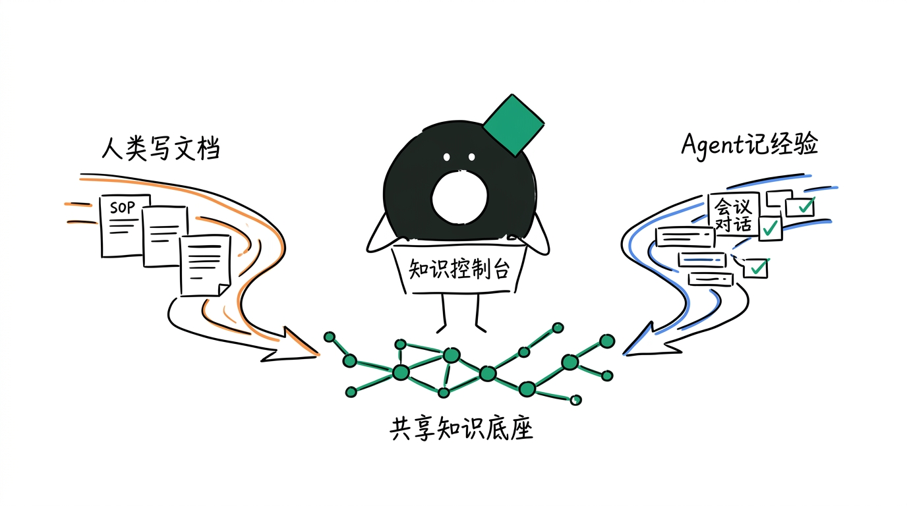
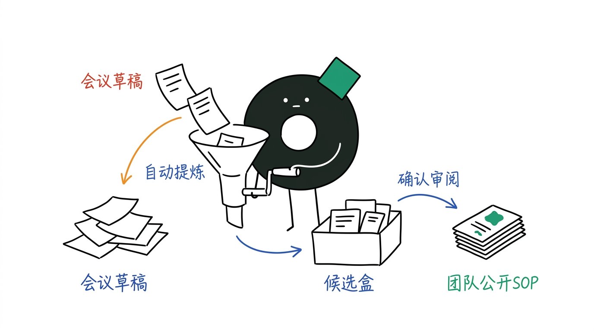
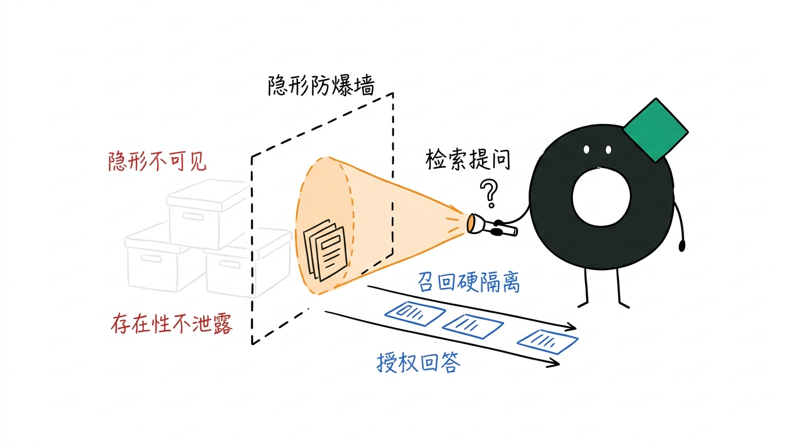
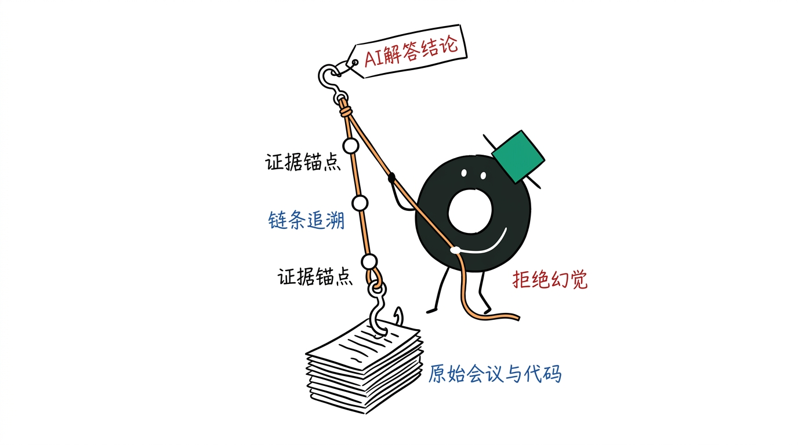
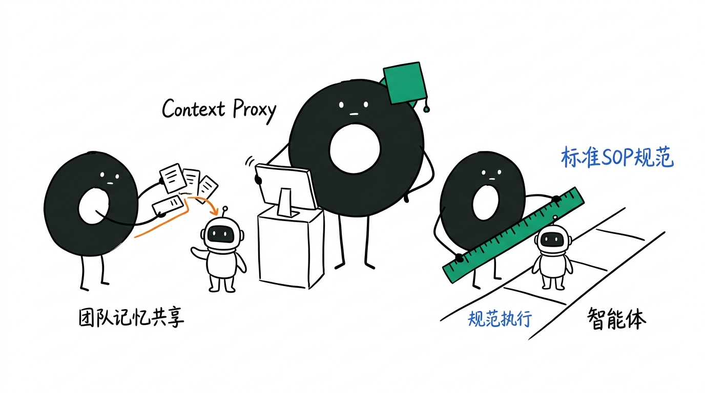

# 一分钟认识 Mora：面向团队与 AI Agent 的“第二大脑”

> [!IMPORTANT]
> **一句话定义 Mora**：Mora 是人类员工与 AI Agent 共同使用的知识控制面 —— 它既是一个可以多人实时协同编辑的**在线文档库**，也是一个能够自动把 Agent 对话与会议经验转化为团队资产的**记忆仓库**。

---

## 01. Mora 到底是什么？

如果你和团队正在使用 AI，你一定遇到过这样的困局：

- 团队写好的 SOP 和制度躺在 **飞书 / Notion** 里，AI 助手根本读不到；
- 员工每天在 **ChatGPT / Claude** 对话框里提炼的会议摘要、解决问题的技巧，关掉窗口就随风散去；
- 尝试把文档扔给 AI 知识库，又担心 AI 把 HR 薪酬、财务隐私乱讲给没有权限的人。

**Mora 就是为了打破这些隔阂而生的新品类。**

简单来说：**人类在上面写文档，AI Agent 在上面记经验，全公司在上面安全协同。**

---

## 02. 它和现有的工具有什么不同？

| 协同维度 | 传统在线文档 (飞书 / Notion) | 普通 AI 问答库 (RAG 插件) | **Mora 人机受控知识库** |
| :--- | :--- | :--- | :--- |
| **谁在使用** | 只有人类员工在写 | 只有 AI 在检索 | **人类员工与 AI Agent 共同协同** |
| **经验从哪来** | 靠人类手动一篇篇撰写 | 把纯文本切碎塞给大模型 | **人类撰写 + Agent 会议与对话自动沉淀** |
| **质量把关** | 依赖人工反复核对 | AI 随意生成，容易混入错漏 | **候选审核机制：AI 提炼必须审核后落库** |
| **数据安全** | 仅按部门展示隐藏 | 容易越权回答敏感隐私 | **召回级硬隔离：没有权限的内容完全隐形** |
| **流程约束** | 依靠人工阅读与监督 | 无法约束 AI 执行步骤 | **Context Proxy：让 Agent 严格遵从 SOP 执行** |

---

## 03. 在你的团队里，Mora 怎么工作？

不需要改变团队现有的工作习惯，Mora 会像助手一样融入你的日常业务：

### 1. 团队日常协同：开会与文档撰写
- **像在线文档一样流畅**：支持块级 Markdown 编辑与多人在线实时协同。
- **自动变成团队记忆**：开会时 Agent 提炼的待办事项与决策结论，不会直接变成垃圾文件，而是进入“候选盒”；经负责人确认后，一键转为团队公开 SOP。

### 2. 跨部门安全问答：告别隐私泄漏
- **不同部门严格隔离**：HR 的薪酬制度、财务的成本报表、研发的核心代码，拥有严格的安全防爆墙。
- **智能回答不越权**：无论是员工搜索还是 Agent 查资料，无权访问的内容在检索中彻底隐形，连文件的存在都不会泄露。

### 3. 经验有据可查：拒绝 AI 幻觉
- **结论一拉到底**：在 Mora 里，AI 给出的每一条解答、总结的每一项经验，都带有可点击的“证据锚点”，可以直接追溯到最原始的会议记录、代码提交或政策文件。

### 4. Context Proxy 模式：共享团队记忆 + 规范 Agent 遵从 SOP 执行
- **静默共享团队记忆**：Context Proxy 在员工与 Agent 对话时自动静默代理，实时注入团队积累的业务背景与历史记忆，无需员工每次在 Prompt 中重复解释背景。
- **规范 Agent 严遵 SOP 流程**：不仅提供知识，Context Proxy 还能将公司的标准操作流程（SOP）与合规规范直接约束注入给 Agent，指导 Agent 严格按照既定步骤执行任务，防止操作脱轨。

---

## 04. 总结：AI 时代的团队知识新范式

Mora 不是要替代你现有的工作，而是帮你把**人类的思考**与 **AI 的记忆**串联起来。

不用再担心 AI 生成内容污染知识库，也不用担心敏感数据泄漏。在 Context Proxy 的辅助下，不仅能让团队记忆高效共享，更能确保智能体始终按照公司的标准 SOP 规范执行。每一次讨论、每一份文档、每一条 AI 经验，都将安全地转化为团队可持续复用的资产。
