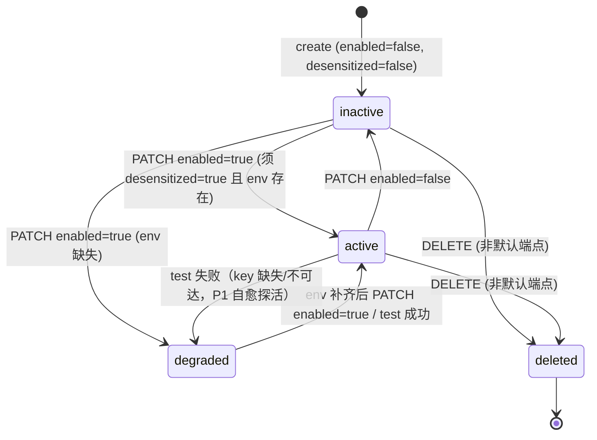
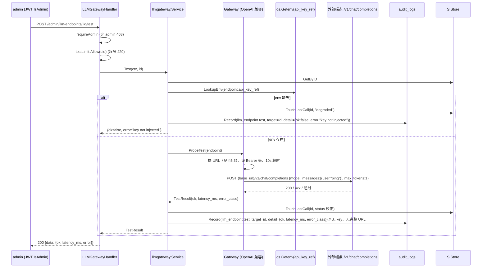

# 11. LLM 网关设计（自定义 LLM 供应商管理）

> 阶段 1 架构交付物（YS-89）。对齐父 issue YS-88 PRD（AC-1~AC-10）。
> 本文为架构定稿：数据模型 DDL（作为研发实现规格）、迁移要点、索引策略、API 契约、调用网关、审计与限流、模块归属、边界确认与验收映射。
> **实现（迁移 SQL 文件、handler/service/store 代码）属 YS-90 研发职责，不在本架构层产出。**

## 0. 背景与范围

Mora 现有能力栈**只有 Embedding 推理链路**（TEI / Ollama，受 `embedding_models` 表与 `/api/v1/admin/embedding-models` 管理），**不存在任何生成式 LLM（chat/completion）调用层**。而平台已有多个规划中的生成式能力缺口依赖外部 LLM：文档解析多模态（design-docs/10，VLM/QAGen，P2）、MCP `completion` 工具（design-docs/06 标注 ❌ 未实现）、前端已落地「外部 LLM 网关」面板 `web/src/components/parse/LlmGatewayPanel.tsx`（纯前端空态，后端缺失）。

本设计为 Mora 提供一套**自托管、私有化优先、默认不出网**的自定义 LLM 供应商管理能力，使管理员可在平台内集中纳管「OpenAI 兼容端点 / 模型 / API Key 引用 / 出网开关」，供未来 VLM、问答生成、MCP `completion` 等生成式特性统一复用。

### 范围内（本期 MVP）

- `llm_endpoints` 表（迁移 `012_llm_gateway`）。
- `/api/v1/admin/llm-endpoints` CRUD + `/:id/test` 测试连接 + `/:id/default` 设默认。
- 运行期调用网关：从 env 读取 `api_key_ref` 指向的真实 Key，注入外部 OpenAI 兼容端点（`/v1/chat/completions` 语义）。
- 审计复用 `audit_logs`；测试连接走独立小配额限流。
- 单活跃默认端点（复用 `embedding_models.SetActive` 模式）。

### 范围外（明确不做）

- **不实现** MCP `completion` 工具本身（design-docs/06 标注 ❌ 维持不变；本能力为其铺路）。
- **不实现** VLM / QAGen 业务逻辑（design-docs/10 P2）。
- **不改动**现有 Embedding / Reranker / RAG 检索 / Qdrant 入库路径（零改动，见 §9）。
- **不提供** API Key 明文 CRUD（产品硬约束：密钥仅环境变量引用，不入库明文）。
- 离线部署（无任何外部端点）时本能力为空态可用，不影响其他功能。

## 1. 设计目标与约束

| 维度 | 目标 |
|------|------|
| 安全 | 密钥仅经环境变量 / K8s Secret 注入，**不入库、不入日志、不入审计明细、不出现在任何 API 响应**；管理面仅 `IsAdmin`；写操作记审计（仅 INSERT）；测试连接受独立限流 |
| 合规 | 默认不出网；`enabled` 默认 false；`enabled=true` 的硬前置 `desensitized=true`（DB CHECK + 应用层双校验） |
| 存在性不泄露 | 非 admin 调用任意 `llm-endpoints` 接口返回 403，且不区分「无端点」与「无权」（与 `IndexStatusHandler` 一致） |
| 兼容 | 100% 私有化；现有 `embedding_models` / `chunks` / `indexing_tasks` / `/rag/search` / Qdrant 零改动 |
| 部署 | 复用 mora-api（无新服务 / 无新容器）；仅 `.env.example` + Helm `secret-config` 增补 Key 变量占位 |

### 关键架构决策

1. **密钥以「环境变量引用名」入库，明文 Key 仅在调用瞬间从 `os.LookupEnv` 读取并直连外部端点。** Key 不经 `config.Config` 结构体（避免任何中间持有），不出现在 `Config.String()` 红acted 输出中。
2. **`is_default` 单活跃：应用层 `SetDefault`（事务内 demote-all → promote-one，镜像 `ModelStore.SetActive`）+ DB 部分唯一索引双保险。**
3. **`enabled` 依赖 `desensitized`：DB CHECK `chk_enable_requires_desens` + 应用层 service 校验双保险**（422 拒绝）。
4. **`status` 生命周期/健康枚举独立于 `enabled`**：`enabled` 是管理员出网意图，`status` 是运行期观测态（见 §3.2 状态机）。
5. **测试连接与业务调用共用同一 `Gateway` 端口**：测试用最小 `chat/completions` 请求（`"ping"`, `max_tokens=1`），10s 超时。
6. **审计语义动作 `llm_endpoint.*` 由 service 层发射**（target=端点 id，detail 不含 Key/不含完整 URL-with-key），与现有 `AuditMiddleware` 的 `http.*` 通用记录并存（语义记录为权威）。

## 2. 模块归属与分层

对齐 02-system-architecture.md §2.1（domain / platform / module / infra / pkg / cmd）与现有 `embedding_models` 的分层惯例（domain struct → infra/pg store → module 端口 → mora handler）：

| 层 | 包 | 职责 | 镜像参照 |
|----|----|------|----------|
| domain | `internal/domain/llm_gateway.go` | `LLMEndpoint` 结构体 + `EndpointStatus` 枚举（框架无关） | `domain.EmbeddingModel`（chunk.go） |
| infra | `internal/infra/pg/llm_gateway_store.go` | `LLMEndpointStore`：`GetByID/List/Create/Update/SoftDelete/SetDefault/TouchLastCall` | `pg.ModelStore`（models.go） |
| module | `internal/module/llmgateway/ports.go` | `Store`、`Gateway` 端口接口 | `rag.ModelStore`/`rag.ProviderFactory`（ports.go） |
| module | `internal/module/llmgateway/gateway.go` | OpenAI 兼容调用网关具体实现（运行期从 env 读 Key、拼 `/v1/chat/completions`、10s 超时、错误分类、不记 Key） | `rag/provider`（TEI/Ollama adapter） |
| module | `internal/module/llmgateway/service.go` | `Service`：编排 CRUD + test + SetDefault + 语义审计发射 | `service.DocumentService`（有 service 层先例） |
| handler | `internal/module/mora/handler/llm_gateway.go` | HTTP handler（admin CRUD + test + default），复用 `requireAdmin`/`MustAuth`/`response` | `handler.EmbeddingModelHandler`（rag_admin.go） |
| cmd | `cmd/mora-api/main.go` | 装配：`pg.NewLLMEndpointStore` → `llmgateway.NewGateway` → `llmgateway.NewService(store, gw, auditLogger)` → `wh.NewLLMGatewayHandler(svc, testLimit)`；注册路由 | 现有 `modelH` 装配行 |

> **为何引入 `llmgateway` 新模块而非塞入 `mora`/`rag`**：llm-gateway 是生成式调用的统一前置，未来被 MCP `completion` 与解析 sidecar 复用，不属于 Wiki 域（mora）也不属于检索域（rag）。独立模块显式表明其可复用边界。HTTP handler 仍放 `module/mora/handler`，与 `EmbeddingModelHandler` 同包，保持 admin HTTP 表层与鉴权/中间件装配的内聚（与现有 `requireAdmin`/`AuditMiddleware` 同包可用）。
>
> **为何引入 `Service` 层（embedding-models 无 service 层）**：embedding-models 的 handler 直连 store+factory，因无需每动作语义审计；本能力 PRD 强制 `llm_endpoint.create/update/delete/test/enable` 语义审计动作，service 层 owning 审计发射比污染 handler 更清晰，且为未来 completion 复用留口。

## 3. 数据模型

### 3.1 `llm_endpoints` 表 DDL（研发实现规格）

> 编号 `012_llm_gateway`，风格对齐 `007_rag.up.sql`（`CREATE TABLE IF NOT EXISTS`、列内注释、迁移头引用设计文档）。up/down 对称。

```sql
-- migrations/012_llm_gateway.up.sql
-- LLM 网关域：自定义 LLM 供应商端点配置（OpenAI 兼容）
-- 依据：design-docs/11-llm-gateway-design.md §3 / PRD YS-88 §6
-- 边界：与 embedding_models/chunks/indexing_tasks 无外键关联（Embedding 路径独立）

CREATE TABLE IF NOT EXISTS llm_endpoints (
    id            UUID PRIMARY KEY DEFAULT gen_random_uuid(),
    name          VARCHAR(255) NOT NULL,
    base_url      TEXT NOT NULL,                   -- 必须带 scheme：http:// 或 https://
    model_name    VARCHAR(255) NOT NULL,
    api_key_ref   VARCHAR(255) NOT NULL,           -- 环境变量名（如 LLM_GATEWAY_KEY_PROD），非明文 key
    enabled       BOOLEAN NOT NULL DEFAULT false,  -- 出网开关；默认 false
    desensitized  BOOLEAN NOT NULL DEFAULT false,  -- 脱敏评估硬约束：enabled=true 须 desensitized=true
    is_default    BOOLEAN NOT NULL DEFAULT false,  -- 默认活跃端点（至多一个，见 uq_llm_endpoints_default）
    status        VARCHAR(20) NOT NULL DEFAULT 'inactive', -- inactive|active|degraded|deleted
    last_call_at  TIMESTAMPTZ,                     -- 最近一次调用（测试或业务）
    created_at    TIMESTAMPTZ NOT NULL DEFAULT now(),
    updated_at    TIMESTAMPTZ NOT NULL DEFAULT now(),
    -- 明文 key 永不入库；api_key_ref 仅存环境变量名
    CONSTRAINT chk_baseurl_scheme CHECK (base_url ~ '^https?://'),
    CONSTRAINT chk_enable_requires_desens CHECK (enabled = false OR desensitized = true),
    CONSTRAINT chk_status CHECK (status IN ('inactive','active','degraded','deleted'))
);

-- 至多一个默认活跃端点：应用层 SetDefault + DB 部分唯一索引双保险
-- （镜像 embedding_models.SetActive 的「单活跃」语义，但用独立 is_default 列而非复用 status）
CREATE UNIQUE INDEX uq_llm_endpoints_default ON llm_endpoints (is_default)
    WHERE is_default = true AND status <> 'deleted';

-- 列表查询：过滤软删除后按更新时间倒序
CREATE INDEX idx_llm_endpoints_listing ON llm_endpoints (status, updated_at DESC)
    WHERE status <> 'deleted';
```

```sql
-- migrations/012_llm_gateway.down.sql
DROP TABLE IF EXISTS llm_endpoints;
```

### 3.2 字段语义与状态机

`enabled`（管理员出网意图，bool）与 `status`（运行期观测态，枚举）**相互独立**，避免 `embedding_models` 那样以 `status` 兼任活跃标志的耦合：

| `enabled` | `status` | 含义 |
|-----------|----------|------|
| false | `inactive` | 新建 / 被禁用，未出网（默认态） |
| true | `active` | 已启用且 `api_key_ref` 指向的 env 变量存在（可调用） |
| true | `degraded` | 已启用但 env 变量缺失，或（P1）最近一次调用失败（不可达） |
| — | `deleted` | 软删除，所有查询 `WHERE status <> 'deleted'` 过滤 |

**状态迁移（MVP）**：



> MVP 实现要点：`PATCH enabled=true` 时 service 调 `os.LookupEnv(api_key_ref)` 决定置 `active` 还是 `degraded`；`POST /:id/test` 后 `TouchLastCall` 并据结果在 `active`/`degraded` 间校正（P1 周期探活为 Could，MVP 仅在 test/调用瞬间校正）。

### 3.3 与现有模型的关系

- **复用** `audit_logs`（迁移 006，按月分区，仅 INSERT）：记录 `llm_endpoint.create/update/delete/test/enable/set_default`，`target_type='llm_endpoint'`，`target_id=端点 id`。
- **复用** JWT `IsAdmin`（`internal/platform/auth/jwt.go`）做管理面鉴权，**不新增角色**。
- **复用** `embedding_models.SetActive` 的「单活跃」事务模式实现 `SetDefault`（§6.2）。
- **不与** `embedding_models` / `chunks` / `indexing_tasks` / `documents` 产生任何外键关联（Embedding 路径独立，见 §9）。

### 3.4 索引策略

| 索引 | 用途 | 选择理由 |
|------|------|----------|
| `uq_llm_endpoints_default`（部分唯一） | DB 层强约束「至多一个默认」 | 应用层 `SetDefault` 的双保险；即使并发 bug 也不会出现两个默认 |
| `idx_llm_endpoints_listing`（部分） | 列表查询过滤软删除 | 管理页列表主路径：`WHERE status<>'deleted' ORDER BY updated_at DESC` |

> 无需在 `name` 上加唯一约束（不设业务自然键，避免多区域同名端点被误拦）；name 唯一性不作为架构硬约束。

## 4. API 契约

路由前缀 `/api/v1/admin/llm-endpoints`，挂载于 `authed` 组（JWT `AuthMiddleware` + `AuditMiddleware`）。鉴权复用 `requireAdmin`（非 admin → 403 `admin only`，存在性不泄露：不区分「无端点」与「无权」）。

### 4.1 通用响应与错误

复用 `internal/pkg/response` 信封 `{code, data, message}` 与 `internal/pkg/errors` 错误码。本域错误映射：

| 场景 | HTTP | code | 说明 |
|------|------|------|------|
| 非 admin | 403 | `40300` | `admin only`，不泄露端点存在性 |
| 资源不存在 / 无权 | 404 | `40400` | 统一 `not found`（不泄露） |
| `enabled=true` 但 `desensitized=false` | 422 | `40000` | `desensitization required before enabling`（DB CHECK 兜底） |
| 删除默认活跃端点 | 409 | `40900` | `cannot delete default endpoint; switch default first` |
| 对默认端点置 disabled 不阻止（见 §6.3）；但调用默认端点时若 disabled 返回 | 503 | `50000` | `default endpoint disabled` |
| env Key 缺失（test/调用） | 200(测试) / 503(调用) | — | 测试返回 `{ok:false, error:"key not injected"}`；调用返回 503 |
| 测试限流超限 | 429 | `42900` | `Retry-After: 60` |

### 4.2 OpenAPI 契约（对齐 04-api-contract.md §9.2 风格）

```yaml
  /admin/llm-endpoints:
    get:
      tags: [LLM Gateway Admin]
      summary: 列出 LLM 端点（不含密钥）
      security: [BearerAuth: []]
      responses:
        '200':
          description: 端点列表（仅 AC-2 字段，无 api_key_ref、无明文 key）
          content:
            application/json:
              schema:
                type: object
                properties:
                  data:
                    type: object
                    properties:
                      items:
                        type: array
                        items: { $ref: '#/components/schemas/LLMEndpointSummary' }
    post:
      tags: [LLM Gateway Admin]
      summary: 新建 LLM 端点（enabled/desensitized 默认 false）
      security: [BearerAuth: []]
      requestBody:
        content:
          application/json:
            schema:
              type: object
              required: [name, base_url, model_name, api_key_ref]
              properties:
                name:        { type: string }
                base_url:    { type: string, pattern: '^https?://.*' }
                model_name:  { type: string }
                api_key_ref: { type: string, description: 环境变量名，非明文 key }
                desensitized: { type: boolean, default: false }
      responses:
        '201':
          description: 创建成功（响应不含明文 key）
          content:
            application/json:
              schema: { $ref: '#/components/schemas/LLMEndpointDetail' }
        '422': { description: 校验失败 }

  /admin/llm-endpoints/{id}:
    get:
      tags: [LLM Gateway Admin]
      summary: 端点详情（含 api_key_ref 引用名与 key 注入状态，不含明文 key）
      security: [BearerAuth: []]
      parameters: [{ name: id, in: path, required: true, schema: { type: string, format: uuid } }]
      responses:
        '200': { description: 详情, content: { application/json: { schema: { $ref: '#/components/schemas/LLMEndpointDetail' } } } }
        '404': { description: 不存在或无权（不区分） }
    patch:
      tags: [LLM Gateway Admin]
      summary: 更新端点（部分字段；id 不可改）
      security: [BearerAuth: []]
      parameters: [{ name: id, in: path, required: true, schema: { type: string, format: uuid } }]
      requestBody:
        content:
          application/json:
            schema:
              type: object
              properties:
                name:         { type: string }
                base_url:     { type: string, pattern: '^https?://.*' }
                model_name:   { type: string }
                api_key_ref:  { type: string }
                enabled:      { type: boolean, description: 置 true 须 desensitized=true，否则 422 }
                desensitized: { type: boolean }
      responses:
        '200': { description: 更新成功, content: { application/json: { schema: { $ref: '#/components/schemas/LLMEndpointDetail' } } } }
        '422': { description: enabled=true 但 desensitized=false }
        '404': { description: 不存在或无权 }
    delete:
      tags: [LLM Gateway Admin]
      summary: 软删除端点（默认活跃端点不可删，409）
      security: [BearerAuth: []]
      parameters: [{ name: id, in: path, required: true, schema: { type: string, format: uuid } }]
      responses:
        '204': { description: 已软删除（status=deleted） }
        '409': { description: 默认活跃端点不可删除，须先切换默认 }

  /admin/llm-endpoints/{id}/test:
    post:
      tags: [LLM Gateway Admin]
      summary: 测试连接（最小 chat/completions 请求；受独立限流；记审计）
      security: [BearerAuth: []]
      parameters: [{ name: id, in: path, required: true, schema: { type: string, format: uuid } }]
      responses:
        '200':
          description: 测试结果
          content:
            application/json:
              schema:
                type: object
                properties:
                  data:
                    type: object
                    properties:
                      ok:         { type: boolean }
                      latency_ms: { type: integer }
                      error:      { type: string, description: 失败原因类别，不含 key/不含完整 URL }

  /admin/llm-endpoints/{id}/default:
    post:
      tags: [LLM Gateway Admin]
      summary: 设为默认活跃端点（旧默认自动降级；目标须 enabled=true）
      security: [BearerAuth: []]
      parameters: [{ name: id, in: path, required: true, schema: { type: string, format: uuid } }]
      responses:
        '200': { description: 已设为默认, content: { application/json: { schema: { $ref: '#/components/schemas/LLMEndpointDetail' } } } }
        '422': { description: 目标端点未 enabled，不可设为默认 }
        '404': { description: 不存在或无权 }
```

### 4.3 响应 Schema（永不出现明文 Key）

```yaml
components:
  schemas:
    LLMEndpointSummary:   # 列表项：AC-2 精确字段集
      type: object
      properties:
        id:           { type: string, format: uuid }
        name:         { type: string }
        base_url:     { type: string }
        model_name:   { type: string }
        enabled:      { type: boolean }
        desensitized: { type: boolean }
        is_default:   { type: boolean }
        status:       { type: string, enum: [inactive, active, degraded] }  # 列表不返回 deleted
        last_call_at: { type: string, format: date-time, nullable: true }
    LLMEndpointDetail:    # 详情：在 Summary 基础上增 key 引用名 + 注入状态
      allOf:
        - $ref: '#/components/schemas/LLMEndpointSummary'
        - type: object
          properties:
            api_key_ref:   { type: string, description: 环境变量名（非明文 key） }
            key_injected:  { type: boolean, description: os.LookupEnv(api_key_ref) 是否命中 }
            created_at:    { type: string, format: date-time }
            updated_at:    { type: string, format: date-time }
```

> **明文 Key 永不出现**：无任何字段承载 Key 值。`api_key_ref` 仅是环境变量名（如 `LLM_GATEWAY_KEY_PROD`），`key_injected` 是 bool 探测结果——管理员据此判断密钥是否注入，无需也不可见明文。对齐前端 `LlmGatewayPanel` 的 `api_key` 字段恒为 `disabled`。
>
> **前端 camelCase 映射**（`baseUrl`/`modelName`/`lastCall`/`isDefault`）属 YS-91 前端对接职责，API 层保持 snake_case 与 04-api-contract 一致。

## 5. 调用网关设计

### 5.1 端口与实现

```go
// internal/module/llmgateway/ports.go（架构规格，研发实现）
package llmgateway

type Store interface {
    GetByID(ctx context.Context, id string) (domain.LLMEndpoint, error)
    List(ctx context.Context) ([]domain.LLMEndpoint, error)               // 过滤 deleted
    Create(ctx context.Context, e domain.LLMEndpoint) (domain.LLMEndpoint, error)
    Update(ctx context.Context, id string, patch domain.LLMEndpointPatch) (domain.LLMEndpoint, error)
    SoftDelete(ctx context.Context, id string) error
    SetDefault(ctx context.Context, id string) error                       // 事务：demote-all → promote-one
    TouchLastCall(ctx context.Context, id string, status string) error     // test/调用后更新 last_call_at + status
}

type Gateway interface {
    // ChatCompletion 调用 OpenAI 兼容端点。key 仅从 os.LookupEnv(endpoint.APIKeyRef)
    // 读取并写入出站请求的 Authorization 头，不返回、不记录、不入审计明细。
    ChatCompletion(ctx context.Context, endpoint domain.LLMEndpoint, req ChatRequest) (ChatResponse, error)
    // ProbeTest 发起最小测试请求（"ping", max_tokens=1），用于 POST /:id/test。
    ProbeTest(ctx context.Context, endpoint domain.LLMEndpoint) (TestResult, error)
}
```

### 5.2 调用流程（测试连接为例）



### 5.3 base_url 规范化

前端 placeholder 为 `https://llm.internal/v1`，故 `base_url` 可能含 `/v1` 也可能不含。网关按以下规则拼装（仅去末尾 `/`，按是否以 `/v1` 结尾决定追加路径）：

```
normalize(base_url):
  u = trimRight(base_url, '/')
  if u endswith '/v1' : return u + '/chat/completions'
  else                : return u + '/v1/chat/completions'
```

即 `https://llm.internal` 与 `https://llm.internal/v1` 均得 `…/v1/chat/completions`。`chk_baseurl_scheme` 已在 DB 层保证带 scheme。

### 5.4 密钥不泄露硬约束

| 位置 | 处理 |
|------|------|
| 入库 | 仅 `api_key_ref`（env 变量名），明文 Key 永无列 |
| 调用 | `os.LookupEnv(api_key_ref)` 取值 → 直接写入出站 `Authorization: Bearer <key>` → 请求发出后值不保留于任何结构体 |
| 日志 | 网关使用不打印请求头的 `http.Client`；结构化日志只记 `endpoint_id`、`latency_ms`、`error_class`，禁记 `Authorization`/`base_url+key` |
| 审计明细 | `detail` 仅含 `{ok, latency_ms, error_class, name, base_url_host}`（`base_url_host` 仅主机名，不带 scheme 外路径、不含 key） |
| API 响应 | 无明文 Key 字段（§4.3） |
| 错误信息 | 上游 401 → `upstream rejected key`（不回显 key）；连接拒绝 → `upstream unreachable`；超时 → `timeout` |

### 5.5 超时与 TLS

- 测试连接：`http.Client{Timeout: 10s}`（PRD NFR）。
- 业务调用（未来 completion）：可配 `LLM_GATEWAY_CALL_TIMEOUT`，MVP 不实现 completion 故不引入。
- TLS：私有部署内部端点可能用自签 CA；MVP 用系统默认信任。自签 CA 场景部署侧挂载 CA 至容器 `/usr/local/share/ca-certificates/` 并设 `SSL_CERT_FILE`（部署文档说明，不在代码内处理，避免 MVP 过度工程）。

## 6. 关键业务规则

### 6.1 `enabled` 依赖 `desensitized`（AC-3）

双校验：
1. **DB CHECK** `chk_enable_requires_desens`：`(enabled = false OR desensitized = true)`。
2. **应用层** `Service.Update`：PATCH `enabled=true` 前先校验当前 `desensitized=true`，否则返回 422 `desensitization required before enabling`（友好错误先于 DB CHECK 触发，避免暴露底层约束名）。

### 6.2 单活跃默认端点（AC-5）

`SetDefault(ctx, id)` 事务（镜像 `ModelStore.SetActive`）：
```sql
BEGIN;
UPDATE llm_endpoints SET is_default=false, updated_at=now()
  WHERE is_default=true AND status<>'deleted';
UPDATE llm_endpoints SET is_default=true, updated_at=now()
  WHERE id=$1 AND status<>'deleted' AND enabled=true;   -- 须 enabled=true
COMMIT;
```
- 目标须 `enabled=true`，否则 422（不可把禁用端点设为默认，对齐 PRD §5 流程：default 在 enable 之后）。
- DB 部分唯一索引 `uq_llm_endpoints_default` 为并发兜底：即使事务异常也不会残留两个默认。

### 6.3 软删除与默认端点（AC-6）

- `SoftDelete`：`UPDATE llm_endpoints SET status='deleted', is_default=false, updated_at=now() WHERE id=$1 AND status<>'deleted' AND is_default=false`。
- 若目标 `is_default=true`，service 先检查并返回 409 `cannot delete default endpoint; switch default first`（不静默降级默认，强制管理员显式切换）。
- 软删除后所有列表/详情查询 `WHERE status<>'deleted'` 过滤，GET 已删端点返回 404（与无权同形，不泄露）。
- **禁用默认端点不自动清除 `is_default`**：`PATCH enabled=false` 对默认端点放行（管理员可能临时关停再开）；调用「默认端点」时若 `enabled=false` 返回 503 `default endpoint disabled`，不静默回退其他端点。

## 7. 审计与限流

### 7.1 审计（复用 006 `audit_logs`）

由 `llmgateway.Service` 调 `audit.Logger.Record` 发射语义动作（`audit.Logger` 经 `cmd/mora-api/main.go` 注入）：

| 动作 | 触发 | target_id | detail（不含 key/不含完整 URL） |
|------|------|-----------|-------------------------------|
| `llm_endpoint.create` | POST 创建 | 新 id | `{name, base_url_host, model_name, api_key_ref}` |
| `llm_endpoint.update` | PATCH 更新 | id | `{fields_changed: [...], enabled, desensitized}` |
| `llm_endpoint.set_default` | POST /:id/default | id | `{prev_default_id}` |
| `llm_endpoint.enable` | PATCH enabled 翻转为 true | id | `{desensitized:true}` |
| `llm_endpoint.delete` | DELETE 软删 | id | `{name}` |
| `llm_endpoint.test` | POST /:id/test | id | `{ok, latency_ms, error_class}` |

> 现有 `AuditMiddleware` 仍会对每个 POST/PATCH/DELETE 发射 `http.METHOD.path` 通用记录（低保真路径级），与本域语义记录并存，语义记录为权威。`SetAuditTarget` 可在 handler 内补充通用记录的 target，两不冲突。

### 7.2 限流（复用 `ratelimit.Limiter`）

| 接口 | 限流器 | 默认配额 | env |
|------|--------|----------|-----|
| `POST /:id/test` | 独立 `testLimit` | 10 req/min/admin | `RATE_LIMIT_LLM_TEST_PER_MIN`（默认 10） |
| 其余 admin CRUD | 挂 `authed` 组，无独立限流（低频管理操作） | — | — |

- 复用 `RateLimitMiddleware(testLimit)`，按 admin `UserID` 计量，超限 429 + `Retry-After: 60`（与现有 `docLimit`/`searchLimit` 同模式）。
- 测试连接不计入业务限流（PRD §4.4），但每次测试写审计（§7.1）。

### 7.3 配置增补（AC-10）

`config.Config` 仅增一个非敏感限流字段（**不加载 Key 值**）：

```go
// internal/platform/config/config.go（架构规格）
RateLimitLLMTestPerMin int  // RATE_LIMIT_LLM_TEST_PER_MIN，默认 10
```

`.env.example` 与 Helm `secret-config` 增补（**Key 变量仅占位，值为空，部署时注入**）：

```ini
# ── 外部 LLM 网关（design-docs/11；默认不出网，enabled 默认 false） ────
# 测试连接独立限流（每 admin 每分钟）
RATE_LIMIT_LLM_TEST_PER_MIN=10
# 端点 API Key 占位：在管理面填写 api_key_ref 指向下列变量名之一（或自定义），
# 真实 Key 由部署环境注入；Mora 代码/DB/日志永不持有明文 Key。
# LLM_GATEWAY_KEY_PROD=
# LLM_GATEWAY_KEY_STAGING=
```

> Key 变量在 `.env.example` 中以注释形式占位（不赋值），与 `JWT_SECRET`/`MINIO_SECRET_KEY` 等敏感值同段位处理；Helm 侧在 `secret-config` 中以空值占位供部署注入。

## 8. 鉴权与存在性不泄露

- 复用 `AuthMiddleware`（JWT）+ `requireAdmin`（`IsAdmin` 校验）：非 admin → 403 `admin only`，**不新增角色**。
- `GetByID` 在 service 层对「不存在」与「无权」统一返回 `NotFound`（与 `IndexStatusHandler`/`EmbeddingModelHandler` 一致）：非 admin 因 `requireAdmin` 先行 403，admin 访问不存在 id 得 404，二者对调用者不可区分（存在性不泄露，AC-7）。
- `AuditMiddleware` 不审计 GET（低量），写操作自动审计 + service 语义审计双管。

## 9. 边界确认：Embedding / Reranker 零改动（AC-8）

本能力与现有 RAG 链路**完全解耦**，确认以下路径零改动：

| 现有路径 | 是否改动 | 说明 |
|----------|----------|------|
| `embedding_models` 表（007） | 否 | 独立表，无外键关联 `llm_endpoints` |
| `internal/infra/pg/models.go`（ModelStore） | 否 | 不触碰 |
| `/api/v1/admin/embedding-models`（rag_admin.go EmbeddingModelHandler） | 否 | 独立路由组，不共享 store/handler |
| `rag/search`、`internal/module/rag/search`（RRF 混合检索） | 否 | 不依赖 llm_endpoints |
| Qdrant 向量入库（`mora_chunks_*` 集合） | 否 | 与 LLM 网关无关 |
| `indexing_tasks` / `chunks` | 否 | 无外键关联 |
| `cmd/mora-api/main.go` 现有装配 | **仅追加** | 新增 `LLMEndpointStore`/`Gateway`/`Service`/`Handler` 装配行 + 新路由组；不改动现有装配 |
| `config.Load()` | **仅追加** | 新增 `RateLimitLLMTestPerMin` 字段与 env 读取；现有字段与默认值不变 |

回归验证（YS-92）：本特性上线后，`embedding_models` 表与 `/api/v1/admin/embedding-models`、`rag/search`、Qdrant 入库行为无任何变化。

## 10. 未来演进（不在本期实现）

- **MCP `completion` 工具**（design-docs/06 标注 ❌ 维持）：未来实现时调用 `llmgateway.Gateway.ChatCompletion`，以 `is_default` 端点（或调用方指定 id）发起 `chat/completions`，继续受 MCP 现有 RBAC + 速率限制约束。本设计已为其预留 `Gateway` 端口与 `is_default` 单活跃语义。
- **多模型列表**（端点下多 `model_name`）：PRD §4.2 P1，MVP 用端点级单一 `model_name` 已够；演进时新增 `llm_endpoint_models` 子表，不影响本期 `llm_endpoints` 结构。
- **`status=degraded` 周期自愈探活**：PRD §10 Could/P1，依赖调用链路上线后才有真实信号；MVP 仅在 test/调用瞬间校正 `status`。
- **Prometheus 指标**：PRD §9 Could/P1，接入 `internal/platform/observ` 暴露端点状态与调用计数。

## 11. 验收映射（AC-1 ~ AC-10）

| AC | 设计落实处 |
|----|-----------|
| AC-1 创建端点响应不含明文 Key | §4.2 POST 响应 `LLMEndpointDetail`（§4.3 无明文 Key 字段）；§5.4 不入库 |
| AC-2 列表仅返回 AC-2 字段集 | §4.2 GET 响应 `LLMEndpointSummary`（精确字段集，无 `api_key_ref`） |
| AC-3 `desensitized=false` 时 `enabled=true` 返回 422，置 true 后可启用 | §6.1 双校验（DB CHECK + service 422） |
| AC-4 test 对可达返回 ok、不可达 fail+错误，每次写 `llm_endpoint.test` 审计 | §5.2 流程 + §7.1 审计动作表 |
| AC-5 设默认后旧默认降级，至多一个 `is_default=true` | §6.2 `SetDefault` 事务 + `uq_llm_endpoints_default` 部分唯一索引 |
| AC-6 删非默认成功（软删 `status=deleted`），删默认 409 | §6.3 `SoftDelete` |
| AC-7 非 admin 返回 403 且不泄露存在性 | §8 `requireAdmin` + 统一 `NotFound` |
| AC-8 Embedding/Reranker/RAG/Qdrant 零改动 | §9 边界确认表 |
| AC-9 表中无明文 Key 列，`api_key_ref` 仅存环境变量名 | §3.1 DDL + §5.4 |
| AC-10 `.env.example` 与 Helm `secret-config` 增补 `LLM_GATEWAY_KEY_*` 占位 | §7.3 配置增补 |

## 12. 风险与缓解

| 风险 | 缓解 |
|------|------|
| 并发下出现两个默认端点 | `uq_llm_endpoints_default` 部分唯一索引 DB 兜底（§6.2） |
| `enabled` vs `status` 语义混淆 | §3.2 明确：`enabled`=管理员意图，`status`=运行期观测；状态机图定稿 |
| 明文 Key 经日志/审计泄露 | §5.4 六处硬约束；网关用不打印请求头的 client；审计 detail 仅 host+error_class |
| `api_key_ref` 指向不存在的 env 变量 | `status=degraded` + test/调用明确 503/`{ok:false}`，不静默失败（§3.2/§5.2） |
| 内部端点自签 CA 导致 TLS 失败 | 部署侧挂载 CA + `SSL_CERT_FILE`（§5.5，MVP 不在代码内处理） |
| 范围蔓延到 completion 实现 | §0 明确范围外；design-docs/06 `completion` ❌ 维持；`Gateway` 端口预留但本期不接 MCP |
