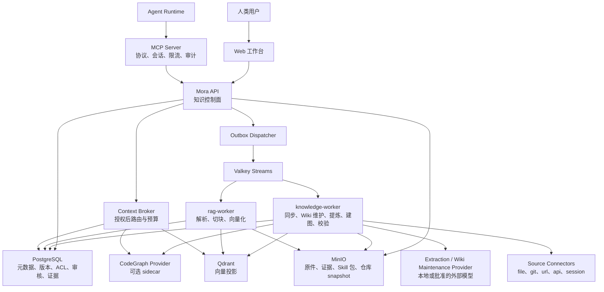
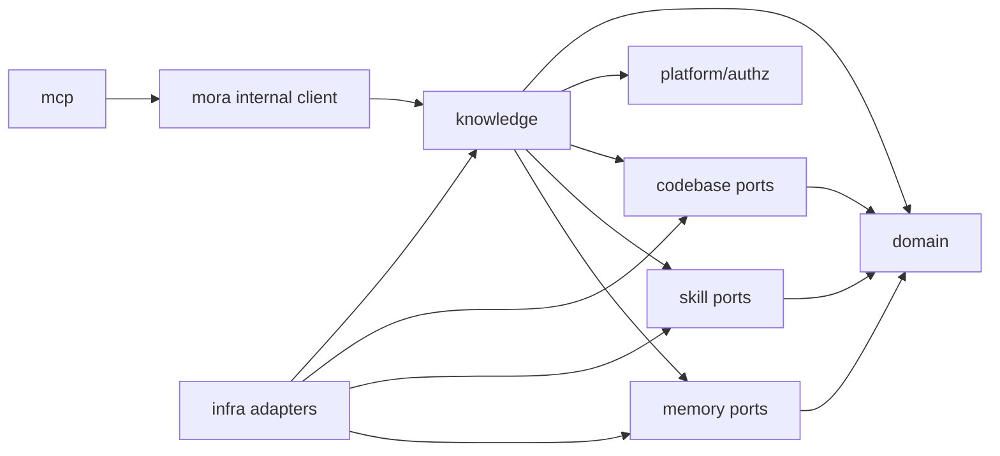
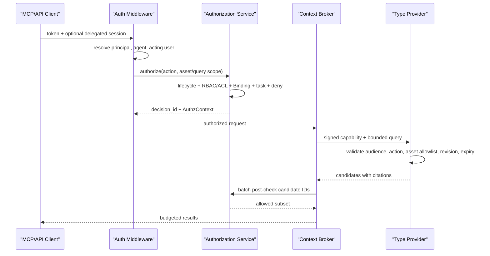
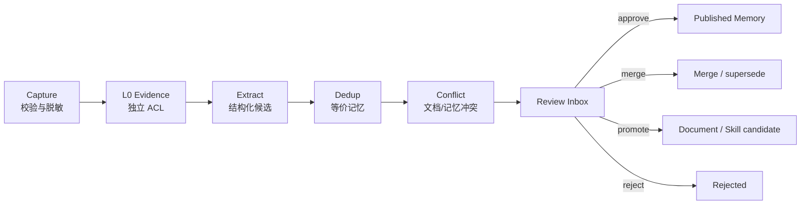

# Mora 人与 Agent 统一知识技术架构

> 文档版本：v0.2 ｜ 状态：讨论稿 ｜ 更新日期：2026-08-10
> 适用读者：架构、后端、Agent 集成、安全、运维与测试团队
> 上位蓝图：11-human-agent-knowledge-blueprint.md
> 关联设计：02-system-architecture.md、03-data-model.md、05-rag-pipeline-design.md、06-mcp-server-design.md、07-security-observability.md、10-document-parsing-design.md

---

## 0. 摘要与架构决策

本设计把 Mora 从“文档协作 + RAG + MCP”扩展为面向人和 Agent 的受治理知识底座，同时保持现有模块化单体和私有化部署优势。

首版采用以下技术方案：

1. **控制面留在 Mora API**：资产身份、版本、来源、关系、治理、Agent Binding、权限和审计仍由 Mora 统一负责。
2. **权威记录与投影分离**：PostgreSQL 与 MinIO 保存不可由索引重建的记录；FTS、Qdrant、CodeGraph、摘要和关系建议均为可重建投影。LLM 生成并经治理保留的 Wiki 页面是 Document 版本，不是可随时丢弃的摘要投影。
3. **新增一个异步进程**：`knowledge-worker` 负责来源同步、Wiki 维护、记忆提炼、Skill 校验和 CodeGraph 构建；现有 `rag-worker` 继续负责文档解析、切块和向量化。
4. **不按资产类型拆微服务**：`knowledge`、`memory`、`skill` 和 `codebase` 先作为同仓库内的领域模块，通过端口接口隔离实现。
5. **新链路使用事务 Outbox**：业务状态与待发布事件在同一 PostgreSQL 事务提交，再由 Dispatcher 投递 Valkey Streams，避免“数据库成功、消息丢失”。
6. **版本构建后原子切换**：新版本先进入 `building`，必需投影就绪后再更新 `knowledge_assets.current_version_id`；失败时继续服务最后可用版本。
7. **授权先于内容交付**：MCP、REST、Context Broker 和 Provider 共享一次授权决策；Provider 只能在裁剪后的资产范围和动作范围内运行。
8. **MCP 仍是 Agent 第一入口**：MCP Server 只做协议、会话、限流和审计适配，不直连类型引擎，也不复制业务授权逻辑。
9. **第三方能力 sidecar 化**：CodeGraph、复杂解析和可选记忆模型通过 Provider/Connector 接入；Mora 不依赖第三方控制面，也不通过未声明的深层包路径耦合第三方内部实现。
10. **首版不执行 Skill、不自动发布团队记忆**：Skill 只保存、校验和交付；团队记忆必须经过显式审核。
11. **Wiki 是 Document 的维护方式**：Wiki 页面、Schema、目录和综合结论仍登记为 Document Asset；新增的是增量维护、依赖追踪、冲突检查和候选修订流程，不增加一级资产类型。
12. **上游采用必须可复现**：任何嵌入、移植或 sidecar 依赖都固定版本和校验和，记录来源提交、许可证、SBOM、NOTICE 与本地修改映射。

### 0.1 交付边界

本文定义可进入详细设计和实现的技术骨架：

- 进程与模块边界。
- 核心表及不变量。
- 授权决策和 Agent 身份传播。
- 来源同步、资产版本、记忆沉淀和检索交付数据流。
- Provider、Connector、事件和内部 API 契约。
- 部署、故障降级、可观测、迁移和测试策略。

本文不展开每个 REST/MCP 字段、完整 SQL、具体 CodeGraph 产品选型、记忆提炼 Prompt 和前端交互细节；这些由后续专项设计承接。

---

## 1. 现状、约束与差距

### 1.1 可直接复用的现有能力

| 现有能力 | 当前实现 | 新架构中的角色 |
|---|---|---|
| 模块化单体 | `cmd/mora-api` + `internal/module/*` | 继续作为控制面和领域逻辑承载方式 |
| 文档真源 | PostgreSQL `documents/document_versions/blocks` | Document Asset 的内容与版本 |
| 对象存储 | MinIO/S3 兼容接口 | 上传原件、证据大对象、Skill 包和可选仓库快照 |
| 异步任务 | Valkey Streams + consumer group + dead letter | 继续承载投影构建和同步任务 |
| 文档投影 | PostgreSQL FTS + Qdrant | Document/Memory 的文本检索投影 |
| RAG Worker | 解析、切块、Embedding、Qdrant 写入 | 保持文档专用，不承载所有知识任务 |
| RBAC | `platform/rbac` + `permissions/roles` | 扩展主体、动作和目标，不另建第二套权限系统 |
| MCP Server | 独立进程，调用 Mora API | Agent 知识工具入口 |
| 审计 | `audit_logs` + `mcp_tool_calls` | 记录治理、同步、Provider 和 Agent 使用 |
| 可观测 | Prometheus、结构化日志、OpenTelemetry | 扩展知识任务和 Provider 指标 |

### 1.2 当前实现差距

1. RBAC 只定义 `user/group`、`workspace/directory/document` 和 `read/write/admin`，尚不能表达 Agent 的 `use/assign/share/review`。
2. API Token 只绑定 user 或 service account，缺少 Agent 身份、委托用户和 Binding 上下文。
3. 文档是唯一可检索资产，RAG 端口和 Qdrant payload 都以 `document_id` 为中心。
4. 当前事件主要面向 `doc_events`，没有通用资产版本、来源同步、治理审核和投影状态模型。
5. MCP 工具固定为文档能力，尚无类型路由、上下文预算、冲突展示和统一引用结构。
6. 现有文档事件采用提交后发布加补偿扫描；新跨模块链路需要统一 Outbox，降低遗漏窗口。
7. 代码图谱、记忆证据和 Skill 包没有稳定的 Provider、存储和生命周期契约。

### 1.3 架构约束

- 保持 Docker Compose 可单机部署，新增能力不能强制引入新的状态数据库。
- PostgreSQL 16、Valkey、Qdrant 和 MinIO 继续作为默认基础设施。
- 未启用 CodeGraph 或生成模型时，文档能力和现有 MCP 工具必须继续工作。
- 所有外部连接均为可选配置，并接受出网、凭据、许可证和审计约束。
- 资产检索不得因为异步索引暂时失败而返回未授权内容或未完成版本。
- Agent 写入默认形成候选或草稿，不得直接绕过发布治理。

### 1.4 上游参考与采用基线

本架构以 2026-08-10 审阅时的以下版本为设计基线；基线用于固定已验证的行为，不代表生产实现必须整体 Fork：

| 上游 | 基线 | Mora 的采用边界 |
|---|---|---|
| [TencentDB Agent Memory](https://github.com/TencentCloud/TencentDB-Agent-Memory) | `fe3230f176f1bf5832fee79d12494bbc2d19a8aa`，MIT | 参考统一 Asset、Binding、Wiki、CodeGraph 和 Skill 管理；不复用其控制面、身份、权限和 UI |
| [CodeGraph](https://github.com/colbymchenry/codegraph) | `c6aaa20358cd6adcd04b87bdef8e5803ad146f3a`，npm `1.5.0`，MIT | CodeGraph Provider 首选候选；通过公开库 API 或独立 sidecar 适配，不依赖平台包内部文件路径 |
| [Hermes Agent](https://github.com/nousresearch/hermes-agent) | `cd4317b449f93ef34aab83a7dbce5ef6eb14684f`，MIT | 参考 Agent Skills 兼容格式、渐进式披露、资源目录和静态扫描；Mora 不承担 Runtime 执行 |
| [Karpathy LLM Wiki](https://gist.github.com/karpathy/442a6bf555914893e9891c11519de94f) | gist `ac46de1ad27f92b28ac95459c782c07f6b8c964a` | 仅作为增量维护模式的概念来源，不复制未明确许可的实现或大段文本 |

引入上游前必须形成第三方 ADR，至少记录 `component/upstream_repo/upstream_commit/artifact_version/artifact_digest/license/integration_mode/local_changes/security_owner/upgrade_policy`。发布物生成 SBOM 和 Third-Party Notices；复制或移植 MIT 代码时保留原版权与许可文本。依赖清单必须使用 lockfile 或不可变镜像 digest，禁止以 `^`、`latest` 或可漂移分支作为生产构建输入。

---

## 2. 目标架构

### 2.1 逻辑架构



### 2.2 进程职责

| 进程 | 新增职责 | 明确不负责 |
|---|---|---|
| `mora-api` | Asset Registry、Source、Relation、Review、Agent、Binding、统一授权、Context Broker API | 长时间同步、模型提炼、仓库建图 |
| `mcp-server` | 新 MCP Tools/Resources、Agent 会话身份传播、速率限制、工具审计 | 直接查 PG/Qdrant/CodeGraph、独立计算权限 |
| `rag-worker` | 延续 Document Engine：解析、切块、Embedding、FTS/Qdrant 文档投影 | Git 同步、记忆提炼、Skill 校验 |
| `knowledge-worker` | Source Connector 调度、Wiki Maintenance、资产投影编排、Memory Distiller、Skill Validator、CodeGraph Provider 调用 | 对外业务 API、最终授权决策 |
| `outbox-dispatcher` | 扫描 `outbox_events` 并可靠投递 Valkey | 业务状态修改 |
| `codegraph` sidecar | 固定 commit 的符号图构建与查询 | Mora 身份、ACL、审核和仓库凭据管理 |

`outbox-dispatcher` 首版可作为 `mora-api` 和 worker 内的后台组件运行；规模增长后再独立进程。`knowledge-worker` 与 `rag-worker` 使用同一个 Go 仓库和基础镜像，但保持独立命令、队列和水平扩缩容策略。

### 2.3 部署拓扑

默认 Compose 增加 `knowledge-worker`，并为可选 Provider 保留独立 profile：

```text
mora-api
mcp-server
rag-worker
knowledge-worker
outbox-dispatcher      # 首版可内嵌
codegraph-provider     # profile: codegraph
mora-parser            # 既有可选 profile
postgres / valkey / qdrant / minio
tei-or-ollama           # 既有可选推理服务
```

不启用 `codegraph-provider` 时，代码资产仍可保存仓库元数据和同步状态，但代码专用查询返回 `capability_unavailable`。不配置 Extraction Provider 时，显式证据仍可入库，记忆候选保持 `pending_extraction`，不会丢失。

---

## 3. 模块边界与代码组织

### 3.1 目标目录

```text
cmd/
  mora-api/
  mcp-server/
  rag-worker/
  knowledge-worker/       # 新增
  outbox-dispatcher/      # 可选独立入口

internal/domain/
  knowledge_asset.go
  knowledge_source.go
  knowledge_relation.go
  governance.go
  agent.go
  memory.go
  skill.go
  codebase.go
  knowledge_event.go

internal/module/knowledge/
  asset/                  # Registry、版本切换、生命周期
  source/                 # 来源配置与同步编排
  wiki/                   # Document 页增量维护、依赖、lint 与候选修订
  relation/               # 显式关系与冲突关系
  governance/             # profile、审核、发布、废弃
  binding/                # Agent 固定资产、范围和排除项
  context/                # 类型路由、排序、预算、引用
  handler/                # REST/internal handlers
  worker/                 # 通用 job dispatch

internal/module/memory/
  evidence/               # 证据存储、脱敏、ACL
  distill/                # 提取候选
  dedup/                  # 去重、冲突和合并建议
  recall/                 # 结构化召回与反馈

internal/module/skill/
  package/                # Agent Skills 包、扩展字段、资源和内容哈希
  compatibility/          # 格式 profile、无损导入导出与 Runtime 报告
  validate/               # 静态校验，不执行 Skill

internal/module/codebase/
  sync/                   # repo/branch/commit 解析
  query/                  # 代码查询用例

internal/platform/
  authz/                  # 统一授权服务与 AuthzContext
  outbox/                 # 事务 Outbox
  egress/                 # 出网与 SSRF 防护

internal/infra/
  postgres/               # 新控制面 repository
  qdrant/                 # 通用 asset payload 适配
  codegraph/              # Provider client
  extractor/              # 结构化生成 Provider
  connector/              # file/git/url/api/session
```

### 3.2 依赖规则



必须遵守：

- 领域模块只依赖 `domain`、端口接口和基础平台，不依赖具体 PostgreSQL/Qdrant/HTTP 客户端。
- `mcp` 只依赖内部 API Client，不导入 repository 或 Provider adapter。
- `memory`、`skill`、`codebase` 不直接发布资产；它们返回处理结果，由 `knowledge/asset` 完成版本登记和原子切换。
- `knowledge/context` 可以编排类型查询端口，但不能绕过 `platform/authz`。
- Provider adapter 不接受用户提交的 `allowed_asset_ids`，只接受 Mora 服务端构造的上下文。
- 现有 `mora` 文档模块不反向依赖新模块；通过领域事件和注册适配器把文档登记为资产。

### 3.3 文档兼容适配

Document Asset 不复制 `documents.content`：

```text
knowledge_assets.native_document_id -> documents.id
knowledge_asset_versions.native_document_version_id -> document_versions.id
```

存量文档采用“先双写、再回填、最后对账”的在线迁移：

1. 先上线文档事务内的 Knowledge Outbox 事件，现有 `doc_events` RAG 发布保持不变。
2. 记录 backfill 高水位，按 `documents.id` 分页注册 Asset，按 `document_versions.id` 注册 Version。
3. 实时事件和 backfill 都使用 `native_document_id` 与 `native_document_version_id` 唯一约束 upsert；顺序以文档 `version_no` 和激活 CAS 决定，到达次序不影响结果。
4. 存量已发布文档使用内置 `legacy_migration` governance profile，生成 system approval 并引用原文档状态和迁移批次；该记录不自动认定更高权威等级。
5. 高水位之后执行全量对账，确认文档、版本和 current pointer 一致后再结束迁移模式。

文档创建、发布、回滚和删除继续由现有 `mora` 模块负责。回滚产生的新 DocumentVersion 登记为新 Asset Version；不改写历史映射。

---

## 4. 数据架构

### 4.1 权威记录与投影

| 数据 | 权威存储 | 投影/缓存 |
|---|---|---|
| Mora 文档 | PostgreSQL `documents/document_versions` | FTS、Qdrant、摘要 |
| 生成 Wiki 页面 | PostgreSQL `documents/document_versions` + 页面来源依赖 | FTS、Qdrant、摘要、关系导航 |
| 代码版本 | Git commit + Mora 的来源锚点 | CodeGraph、文件/符号摘要 |
| 会话证据 | PostgreSQL 或 MinIO 加密对象 | 脱敏引用、记忆候选向量 |
| Memory | PostgreSQL 记忆单元与证据链接 | FTS、Qdrant、冲突关系 |
| Skill | MinIO 版本包 + PostgreSQL manifest/hash | 搜索摘要、依赖关系 |
| 治理与授权 | PostgreSQL | Valkey 短 TTL 缓存、索引 payload |

任何投影都必须记录 `asset_version_id`、`projection_kind`、`provider`、`provider_version`、`build_revision` 和 `built_at`，以支持重建、对账和问题定位。Wiki 页面由模型生成并不使其成为投影：一旦形成候选 DocumentVersion，就必须保留正文、来源版本、生成配置和治理历史；重跑维护流程只能创建新版本，不能原地重写历史。

### 4.2 控制面核心表

以下为逻辑表结构；完整 SQL 在数据模型专项设计中给出。

#### `knowledge_assets`

```text
id UUID PK
workspace_id UUID FK
asset_type document | codebase | memory | skill
name / description
owner_type user | group | agent | service_account
owner_id UUID
status draft | processing | candidate | approved | published | deprecated | archived | failed | rejected
visibility private | workspace | restricted | agent | task
governance_profile_id UUID
native_document_id UUID NULL FK documents(id)
current_version_id UUID NULL
latest_requested_version_no BIGINT NOT NULL DEFAULT 0
confidence NUMERIC NULL
valid_from / expires_at
created_at / updated_at
```

关键约束：

- `(asset_type, native_document_id)` 对非空文档引用唯一。
- `current_version_id` 只能指向本资产且 `build_status=ready` 、`governance_status=published` 的版本。
- `published` 资产必须有 governance profile 和批准记录。
- `latest_requested_version_no` 是自动激活的单调栅栏；旧版本晚完成时不得覆盖更新请求。
- 删除默认转换为 `archived/deprecated`；物理删除由保留策略执行。

#### `knowledge_asset_versions`

```text
id UUID PK
asset_id UUID FK
version_no BIGINT
source_id UUID NULL FK
source_revision TEXT
native_document_version_id UUID NULL FK
content_origin human | imported | generated | system
generation_ref JSONB NULL
provider_ref JSONB
content_hash TEXT
dedupe_key TEXT NOT NULL
build_status pending | building | ready | failed | superseded
governance_status candidate | approved | published | rejected | deprecated
activation_policy_snapshot JSONB
approved_by_type / approved_by_id / approved_at
created_by_type / created_by_id
created_at
UNIQUE(asset_id, version_no)
UNIQUE(asset_id, dedupe_key)
UNIQUE(native_document_version_id) WHERE native_document_version_id IS NOT NULL
```

`dedupe_key` 对 Document 使用 `document_version:{id}`，对同步内容使用 `source:{source_id}:{target_key}:{revision}:{content_hash}`，避免 PostgreSQL `NULL` 唯一语义造成重复版本。Wiki 维护产生的版本使用 `wiki:{wiki_space_id}:{page_key}:{input_set_hash}:{maintainer_revision}`。`activation_policy_snapshot` 固化治理 Profile 版本、必需投影集合和自动发布条件，不因构建期间配置变更而漂移。`generation_ref` 只保存模型/Prompt/Schema 版本、输入集合 hash 和维护 Run ID；`provider_ref` 只保存不可执行定位信息，两者都不得保存访问凭据或完整 Prompt 输入。

#### `knowledge_sources` 与 `source_sync_runs`

```text
knowledge_sources:
  id / workspace_id / source_type
  uri_normalized / credential_ref
  sync_policy / trust_level / license
  current_revision / enabled
  last_synced_at / last_error
  created_by / created_at / updated_at

source_sync_runs:
  id / source_id / requested_by
  requested_revision / resolved_revision
  source_config_snapshot JSONB / credential_version TEXT
  governance_profile_id / requested_asset_type
  status queued | fetching | processing | ready | failed | cancelled
  attempt / started_at / finished_at / error_code / error_detail_redacted
  idempotency_key UNIQUE
```

`knowledge_source_targets(source_id, target_key, asset_type, asset_id, selector, active)` 保存 Connector manifest 中稳定 target 与 Mora Asset 的一对多映射，并以 `(source_id, target_key)` 唯一。Connector 每次同步必须返回稳定 `target_key`；资产不得仅靠标题或 URL 推断是否为已有目标。

URI 必须移除内嵌凭据后再持久化。`credential_ref` 指向 Secret 管理器或加密凭据表。Run 创建时必须固化已脱敏的 Source 配置、credential version、治理 Profile 和资产类型；后续编辑 Source 不影响已排队 Run。

#### `knowledge_relations`

```text
id / workspace_id
from_asset_id / from_version_id NULL
relation_type derived_from | explains | implements | supersedes | contradicts | uses | related_to
to_asset_id / to_version_id NULL
origin human | generated | system
confidence / created_by / created_at
```

关系不得跨 workspace，除非未来引入显式跨空间共享协议。`supersedes` 和 `contradicts` 必须保留创建证据或人工决策。

#### Wiki 维护表

Wiki 不作为新的 `asset_type`。一个 Wiki Space 是一组受同一 Schema 和维护策略约束的 Document Asset：

```text
wiki_spaces:
  id / workspace_id / name
  schema_document_id / schema_version_id
  index_document_id / log_document_id
  governance_profile_id / maintenance_policy JSONB
  status active | paused | archived
  created_by / created_at / updated_at

wiki_pages:
  wiki_space_id / document_asset_id
  page_key / page_kind summary | entity | concept | comparison | synthesis | index | log
  automation_state managed | locked | manual
  last_maintained_at / stale_reason
  PRIMARY KEY(wiki_space_id, document_asset_id)
  UNIQUE(wiki_space_id, page_key)

wiki_page_sources:
  page_asset_version_id / source_asset_id / source_asset_version_id
  contribution_hash / relation_kind
  PRIMARY KEY(page_asset_version_id, source_asset_id, source_asset_version_id)

wiki_maintenance_runs:
  id / wiki_space_id / trigger ingest | query_file | lint | manual
  schema_version_id / input_set_hash / model_revision / prompt_revision
  requested_by_type / requested_by_id
  status queued | analyzing | proposing | awaiting_review | applied | failed | cancelled
  proposal_manifest JSONB / started_at / finished_at / error_detail_redacted
```

`schema_document_id` 指向版本化 Document，描述页面类别、命名、引用和维护规则。`page_asset_version_id` 与 `source_asset_version_id` 都指向 `knowledge_asset_versions.id`。每个生成页版本必须通过 `wiki_page_sources` 锚定实际读取的来源版本；仅记录 Source ID 或最新版本不足以复现结论。`managed` 页面允许维护器提出新版本，`locked` 页面只能产生旁路建议，不能覆盖人工正文。`index` 和 `log` 也是可审计 Document：目录由已发布页面确定性重建，日志由 Run/Decision 事件追加，不由模型自由改写。

#### `governance_profiles`、`review_requests`、`review_decisions`

治理 Profile 定义允许的状态转换、审核角色、自动发布条件、默认时效、证据要求和 `required_projections`。每次批准、拒绝、合并、提升和废弃都写不可变 decision 记录；资产当前状态只是这些决策的投影。

首版默认激活要求：

| 资产 | 阻塞激活的条件 | 非阻塞投影 |
|---|---|---|
| Document | 原生/导入内容版本可读且治理已发布 | FTS、vector、summary |
| Codebase | snapshot 可校验；启用代码查询时 CodeGraph ready | summary、relation |
| Memory | 结构化 Memory 与有效 Evidence 链接可读 | vector、summary |
| Skill | 包 hash 一致且静态校验通过 | summary、relation |

非阻塞投影未就绪时，对应查询能力降级或暂不返回该版本，不得把旧投影标记为新版本。

### 4.3 Agent 与 Binding 表

#### `agents`

```text
id UUID PK
workspace_id UUID FK
name / description
owner_id UUID FK users(id)
status active | suspended | revoked
runtime_type TEXT
service_account_id UUID NULL FK
created_at / updated_at
```

Agent 是治理主体，不等同于 API Token。`api_tokens.identity_type` 增加 `agent`，此时 `identity_id=agents.id`；自主调用的基础 RBAC 由 Agent 绑定的 `service_account_id` 提供。吊销 Token 不删除 Agent，暂停 Agent 会使其全部 Token、委托会话和 Binding 失效。

#### `agent_bindings`

```text
id UUID PK
agent_id UUID FK
workspace_id UUID FK
scope_kind asset | workspace | asset_type
asset_id UUID NULL FK
asset_type TEXT NULL
effect allow | deny
version_policy follow_published | pinned
pinned_version_id UUID NULL FK
delivery_mode tool | summary | inline
priority INTEGER
created_by / created_at / revoked_at
```

约束：

- `scope_kind` 决定 `asset_id/asset_type` 的必填组合。
- `deny` 是显式排除项，优先于所有 allow scope。
- `pinned` 只适用于 `scope_kind=asset`，且必须指定属于目标资产的版本。
- Binding 只能缩小 Agent 可用范围，不能赋予 acting principal 原本没有的权限。
- 撤销最终 `use` 权限或添加排除项后，下一次请求必须同步拒绝。

#### `delegated_sessions`、`authorization_decisions` 与 `workspace_authz_revisions`

```text
delegated_sessions:
  id / token_id / agent_id / acting_user_id / workspace_id
  allowed_actions / issued_authz_revision
  expires_at / revoked_at / created_at

authorization_decisions:
  id / workspace_id / authz_revision
  principal_type / principal_id / acting_user_id / agent_id
  action / scope_hash / audience / nonce_hash
  expires_at / consumed_at / revoked_at / created_at

workspace_authz_revisions:
  workspace_id PK/FK / revision BIGINT / updated_at
```

`delegated_sessions` 是服务端可撤销记录，客户端只持有签名 JTI，不能伪造 `acting_user_id`。Permission、Binding、Agent 状态、资产可见性/生命周期和 Task 范围变更必须在同一事务中递增 workspace revision。

### 4.4 Memory 表

```text
memory_evidence:
  id / workspace_id
  owner_type / owner_id
  source_kind session | message | tool_call | document | code
  source_ref / source_asset_id / source_asset_version_id
  visibility private | restricted
  captured_authz_revision / content_hash
  encrypted_content BYTEA NULL
  storage_key TEXT NULL
  redacted_excerpt TEXT
  classification / retention_policy_id
  created_at / expires_at / deleted_at

memory_units:
  id / asset_id / asset_version_id
  memory_type fact | decision | constraint | preference | event
  statement / structured_payload JSONB
  confidence / valid_from / expires_at
  state candidate | approved | published | rejected | deprecated
  superseded_by UUID NULL
  created_at / updated_at

memory_evidence_links:
  memory_unit_id / evidence_id
  quote_locator JSONB
  support_type supports | contradicts
  PRIMARY KEY(memory_unit_id, evidence_id)
```

证据权限独立于 Memory 发布权限。`permissions.target_type` 增加 `evidence`，`ResourceLocator` 必须能解析 Evidence 的 workspace、owner 和来源资产。会话、消息和工具证据默认 `private`，只能由 owner 显式分享；文档和代码证据还必须通过引用资产的当前权限。

`memory_evidence_read` 同时校验 Memory `use/read`、Evidence `read` 和引用资产当前 ACL，只返回最小脱敏片段。`captured_authz_revision` 仅供审计，不能作为今后的访问授权。来源被删除或不可定位时，原文默认不可展开；发布 Memory 不修改 Evidence ACL。

### 4.5 Codebase、Skill 与投影表

```text
codebase_revisions:
  asset_version_id PK/FK
  repo_url_normalized / branch / commit_sha
  snapshot_ref / snapshot_hash / retention_until
  provider_name / provider_version / provider_build_digest
  graph_ref / source_tree_ref / source_tree_hash
  index_schema_version / extraction_version
  build_status / file_count / symbol_count
  built_at / last_error

skill_packages:
  asset_version_id PK/FK
  storage_key / format_id / schema_version
  manifest JSONB / original_frontmatter JSONB
  content_hash / signature / provenance_ref
  validation_status / validation_report JSONB
  compatibility_report JSONB / scanner_version

asset_projections:
  id / asset_version_id
  projection_kind fts | vector | summary | codegraph | relation
  provider / provider_version / build_revision
  status pending | building | ready | failed | stale
  locator JSONB / built_at / last_error
  UNIQUE(asset_version_id, projection_kind, build_revision)
```

`source_tree_ref` 指向 Provider 查询期可读取的、与 `commit_sha` 完全一致的源码树；它与 `graph_ref` 具有相同生命周期。只保存 CodeGraph SQLite 索引不足以返回源码，因为索引仅保存文件 hash、符号位置和关系。Provider 可以持久化只读源码树，也可以在查询前从 `snapshot_ref` 物化，但必须先校验 `source_tree_hash`，且不能读取其他 revision 的工作树。

Mora 不执行 Skill。首版规范 profile 为 `agentskills.io/<spec-version>`，可选 `hermes/*` 扩展按原始 frontmatter 保留。`validation_report` 只做包结构、引用资源、能力声明、哈希、来源信任和静态规则检查；`compatibility_report` 分别说明可无损交付、需 Runtime 适配或不兼容。未知但结构合法的 frontmatter 和资源必须无损保存，不能因 Mora 不理解其语义而丢弃。脚本和二进制可以作为不可信资源存储与交付，但 Mora 的解析、预览、索引和校验路径均不得执行它们。

### 4.6 Outbox 与任务表

```text
outbox_events:
  id UUID PK
  aggregate_type / aggregate_id
  event_type / event_version
  workspace_id / actor_type / actor_id
  destinations TEXT[] / payload JSONB
  occurred_at / published_at / attempt / last_error

outbox_deliveries:
  outbox_event_id / stream / delivery_attempt
  delivered_at / last_error
  PRIMARY KEY(outbox_event_id, stream)

knowledge_jobs:
  id / source_event_id
  job_type / asset_id / asset_version_id / source_id
  target_key / build_revision / dedupe_key UNIQUE
  status pending | running | succeeded | failed | dead | cancelled
  attempt / max_attempt / lease_owner / lease_until
  progress JSONB / error_code / error_detail_redacted
  created_at / updated_at
```

`dedupe_key = job_type + asset_version_id + target_key + build_revision`，同一事件可以扇出多个投影 Job。Outbox 保证生产者事件不丢；`knowledge_jobs` 保证消费幂等、租约恢复、进度展示和人工重试。Outbox 和 delivery 记录默认保留 30 天，重放时保持原 `event_id`、递增 delivery attempt 并写审计。

---

## 5. 身份与授权架构

### 5.1 调用模式

| 模式 | principal | agent | acting user | 权限求交 |
|---|---|---|---|---|
| 人类 Web/API | user | 无 | user | 用户 RBAC/ACL |
| 代表用户的 Agent | agent token | agent | 已验证 user | 用户权限 ∩ Agent use/Binding |
| 自主 Agent | service account/agent token | agent | 无 | service account 权限 ∩ Agent use/Binding |
| 后台 Worker | service identity | 无 | 原始 actor 仅审计 | job capability ∩ workspace/asset allowlist |

`acting_user_id` 不能由普通请求头直接声明。代表用户执行时，MCP 会话必须持有 Mora 签发的短期委托凭证；中间件校验签名后仍需按 JTI 读取服务端 `delegated_sessions` 记录。凭证绑定 user、agent、workspace、允许动作、audience 和过期时间。

### 5.2 AuthzContext

```go
type AuthzContext struct {
    WorkspaceID      uuid.UUID
    PrincipalType   PrincipalType
    PrincipalID     uuid.UUID
    ActingUserID    *uuid.UUID
    AgentID          *uuid.UUID
    TaskID           *uuid.UUID
    AllowedActions   []Action
    AllowedAssetIDs  []uuid.UUID
    DeniedAssetIDs   []uuid.UUID
    AuthzRevision    int64
    DecisionID       uuid.UUID
    ExpiresAt        time.Time
    TraceID          string
}
```

`AllowedAssetIDs` 可以分页或使用服务端保存的短期 `decision_id` 引用，避免在大范围检索时传输超大数组。远端 Provider 收到的是签名后的短期 capability，不接收用户 Token、仓库凭据或完整 ACL。

### 5.3 决策流水线



有效访问必须同时满足：

```text
资产状态允许动作
AND principal 的 RBAC/ACL
AND Agent 的 use 权限
AND Binding allow scope
AND NOT Binding deny/exclusion
AND 可选 task 临时范围
AND Provider capability
```

### 5.4 RBAC 扩展方式

扩展现有类型，不另建平行 ACL：

- `subjects`: 增加 `agent`、`service_account`。
- `targets`: 增加 `asset`、`source`、`agent`、`review`、`evidence`。
- `actions`: 增加 `use`、`assign`、`share`、`review`、`sync`。
- `read` 不自动蕴含 `use`；`admin` 是否蕴含敏感证据读取由 governance profile 决定，不能默认绕过 `private`。

现有 `rbac.Engine` 的 `locate/targetChain` 当前硬编码 workspace/directory/document。实现时先引入通用 `ResourceLocator` 端口，再增加资产和来源定位，避免继续扩大 switch。

### 5.5 索引层权限

- PostgreSQL FTS：JOIN 当前授权视图，返回前再次 batch authorize。
- Qdrant：payload 增加 `asset_id/asset_version_id/asset_type/workspace_id`，保留 acting principal 的 `visible_to` 硬过滤；Agent Binding 使用 `usable_by` 或受控 over-fetch + Mora 侧精确过滤。生产环境启用 TLS 和独立服务凭据，每次查询必须带 workspace 硬过滤；Qdrant 凭据不下发给 MCP 或 Agent。
- CodeGraph：Mora 先确定允许的 codebase/version，再调用 Provider；Provider 不支持跨 allowlist 搜索。
- Reranker/LLM：只有精确授权后的片段才能发送给外部模型。

当动态 Binding 范围导致 Qdrant 无法一次精确过滤时，Broker 分页 over-fetch 并在 Mora 内部过滤，直到满足 Top-N 或达到查询预算。不得把未通过 `use` 检查的正文发送到外部 Reranker。

### 5.6 撤权与缓存

- 每次顶层 API/MCP 请求的授权线性化点，是 Authorization Service 在同一数据库快照中读取当前 `workspace_authz_revisions.revision` 并完成决策。
- 撤权事务与 workspace revision 递增同事务提交；其后开始的新请求必须读到新 revision 并拒绝。
- 允许缓存主体与 Binding 的解析结果，key 必须包含 revision，TTL 不超过 60 秒。
- 新请求发现 revision 变化后不得使用旧缓存。
- Provider capability 必须绑定 audience、decision ID、authz revision 和单次 nonce，有效期不超过 30 秒。Provider 处于同一信任域时通过内部 introspection 或 revision 缓存拒绝已撤销 decision；远程 Provider 必须在每次调用前完成 introspection。
- Qdrant/CodeGraph 的可见性投影异步收敛期间，以 Mora 的最终 batch check 为准。
- Token、Agent 或 service account 被暂停后，中间件立即拒绝，不等待索引更新。

---

## 6. 事件与异步处理

### 6.1 事件信封

```json
{
  "event_id": "uuid",
  "event_type": "asset.version.requested",
  "event_version": 1,
  "aggregate_type": "knowledge_asset",
  "aggregate_id": "uuid",
  "workspace_id": "uuid",
  "actor": {"type": "user", "id": "uuid"},
  "correlation_id": "uuid",
  "causation_id": "uuid",
  "occurred_at": "2026-08-10T12:00:00Z",
  "payload": {}
}
```

事件只携带 ID、revision、动作和必要参数，不携带正文、凭据、完整会话或 Skill 包。

### 6.2 Stream 划分

| Stream | Consumer group | 事件 |
|---|---|---|
| `knowledge_events` | `knowledge_projection` | asset/version/permission/governance 变化 |
| `source_events` | `source_sync` | source.sync_requested/cancelled |
| `wiki_events` | `wiki_maintenance` | wiki.ingest/query_file/lint/reconcile/cancelled |
| `memory_events` | `memory_distill` | evidence.captured/extract/revalidate |
| `codebase_events` | `codegraph_build` | codebase.build/rebuild/delete |
| `doc_events` | 既有 group | document.parse/index/delete/permission_change |

拆 Stream 的原因是 Git 建图、LLM 提炼和通用投影的延迟特征不同，不能互相阻塞消费组。所有 Stream 统一使用 `knowledge_jobs` 记录、指数退避、`XAUTOCLAIM`、dead letter 和人工重投。

### 6.3 事务 Outbox

写请求事务内同时完成：

1. 更新聚合状态。
2. 插入审计记录。
3. 插入 `outbox_events`。
4. 提交事务。

Dispatcher 使用 `FOR UPDATE SKIP LOCKED` 批量领取尚未向目标 Stream 成功投递的事件，投递后写 `outbox_deliveries`；所有必需 Stream 投递完成后才写 `published_at`。Consumer 收到事件后，在 ACK 前以 `dedupe_key` 幂等创建扇出 Job。

重放不以 `published_at` 等同于已消费：管理操作可对保留期内事件新增 delivery attempt；对账器定期扫描“有事件/版本但缺少预期 Job 或 required projection”的状态并重投。Stream 被裁剪不会丢失业务事实。

现有 RAG `doc_events` 暂不一次重写。Phase 0 为新知识事件引入 Outbox，并在文档写事务中双写一份仅供 Asset Registry 的 Knowledge Outbox 事件；旧 RAG 发布器继续服务 `doc_events`。Phase 1 完成 backfill 对账后，再将 RAG 文档事件迁到同一 Dispatcher，同时保留现有 `indexing_tasks` 补偿扫描作为第二道防线。

### 6.4 资产版本原子切换

```text
创建 version(build_status=pending)
  -> 快照 governance_status=candidate 与 required projections
  -> 创建所需 projection jobs
  -> 各 Provider 写临时/版本化投影
  -> projection status=ready
  -> 校验 required projections 全部 ready，更新 build_status=ready
  -> 人工审核或可信来源策略更新 governance_status=published
  -> 两个条件均满足时 CAS 激活 current_version_id
  -> 异步清理被替代版本的可删除投影
```

自动激活使用 `UPDATE ... WHERE latest_requested_version_no=$version_no AND current_version_id IS NOT DISTINCT FROM $expected_current`。CAS 失败表示该构建已过时，只标记 ready 而不切换。人工回滚是独立治理动作，必须显式指定目标版本和 expected current。查询始终解析 `current_version_id`；构建失败、审核未完成或部分投影就绪都不得覆盖最后可用版本。

### 6.5 幂等、租约与取消

- Job 幂等键：`job_type + asset_version_id + target_key + build_revision`。
- 长任务使用数据库租约 `lease_owner/lease_until`；Worker 崩溃后可重新领取。
- Connector、Provider 和对象写入必须支持重复调用；不支持时由 adapter 生成临时资源并在 commit 阶段切换。
- 取消只对未完成任务生效；已生成但未激活的投影标记 `stale` 后异步清理。
- 重试错误分为 `transient`、`permanent`、`policy_denied`；后两者不做无意义重试。

---

## 7. 来源摄取与版本构建

### 7.1 Connector 端口

```go
type SourceConnector interface {
    Type() SourceType
    Validate(ctx context.Context, req ValidateRequest) error
    ResolveRevision(ctx context.Context, source Source) (Revision, error)
    Fetch(ctx context.Context, source Source, revision Revision, sink ContentSink) (FetchManifest, error)
    Health(ctx context.Context) error
}
```

`FetchManifest` 的每个条目必须包含稳定 `target_key`、资产类型、content hash 和内容 locator。`ContentSink` 由 Mora 提供，只允许写任务隔离目录或指定 MinIO 前缀。Connector 不决定资产权限、发布状态和治理 Profile。

### 7.2 摄取流程

```text
创建/更新 Source
  -> 鉴权 sync + 校验网络/凭据/许可证
  -> 快照 Source 配置、credential version、治理策略
  -> 写 source_sync_run + Outbox
  -> knowledge-worker 仅使用 Run 快照解析 revision
  -> 拉取到隔离工作区/对象前缀
  -> 计算 content hash 与 manifest
  -> 按 source_id + target_key upsert SourceTarget/Asset 映射
  -> 按非空 dedupe_key 幂等创建 asset version
  -> 路由到 Document/RAG、Wiki Maintenance、CodeGraph、Memory 或 Skill pipeline
  -> 完成必需投影
  -> candidate 审核或可信来源策略批准
  -> 原子激活 current_version
```

导入或生成内容默认进入 `candidate`。只有治理 Profile 明确允许的可信来源才能自动批准；批准记录保存策略版本和执行主体。

### 7.3 Connector 安全

- URL/API：解析 DNS 后阻止 loopback、link-local、metadata endpoint 和未批准私网；每次重定向重新校验，限制响应大小、类型和跳转次数。
- Git：只允许批准协议和主机；凭据通过一次性 helper 注入，不写入 remote URL、日志或仓库配置。
- 文件：校验 MIME、扩展名、压缩炸弹、路径穿越和文件大小；解析在低权限环境运行。
- API：限制分页、并发、速率和最大单次同步量；游标和 revision 持久化。
- 所有连接：执行出网 allowlist、超时、审计、Secret 脱敏和 license/trust_level 记录。

### 7.4 Git 与 CodeGraph

Git 来源以 `repo + branch + commit` 锚定。为保证 CodeGraph 可重建，Mora 对当前版本和被固定 Binding 引用的版本保留无凭据 Git bundle 或等价不变快照到 MinIO，并记录 hash 和保留期。同步流程只把固定 commit 交给 CodeGraph Provider：

```text
Source Manager 解析 commit
  -> 临时浅克隆或复用受控 mirror
  -> 校验 commit 与子模块策略
  -> 生成并校验不变 snapshot，写入 MinIO
  -> 从 snapshot 生成构建期只读工作树
  -> Provider.Build(capability, snapshot, commit)
  -> 返回 graph_ref + source_tree_ref + 统计 + provider build identity
  -> Mora 登记 projection 并激活版本
  -> 清理临时 clone、构建目录和凭据
  -> 保留 snapshot，以及 graph 查询所需的只读源码树或可验证物化能力
```

Provider 不持有 Git 凭据。`graph_ref`、`source_tree_ref` 和 commit 必须一一绑定；查询前校验 capability 中的 asset version、`graph_ref`、commit 与源码树 hash。active 版本和固定 Binding 引用版本的源码树不能被清理；未固定的旧版本可在保留期后只留 snapshot，并在查询前受控物化。查询结果必须包含 commit、文件路径、行号和符号定位。没有部署版本与运行时证据时，只能描述该 commit 的静态实现，不能宣称生产环境当前行为。

### 7.5 Wiki 增量维护

Wiki 维护器不直接写生产文档，而是读取已授权的固定输入版本并提出 DocumentVersion 候选：

```text
已发布来源版本 / 显式“沉淀回答” / 人工维护 / 定期 lint
  -> 创建 wiki_maintenance_run，固定 Schema、模型、Prompt 和输入版本集合
  -> 读取 Wiki 目录及相关页面摘要，再按需展开页面和来源
  -> 生成结构化 PagePatch[]（create/update/link/contradiction/stale）
  -> 校验 page_key、路径、引用、来源版本、输出大小和内容安全
  -> 对 managed 页面创建候选 DocumentVersion
  -> 对 locked/manual 页面创建旁路建议，不覆盖当前版本
  -> 生成 derived_from/contradicts/supersedes 等候选关系
  -> 人工审核或可信维护策略批准
  -> 逐页 CAS 激活，失败页不影响其他页且保留最后可用版本
  -> 确定性重建 index Document，追加 Run/Decision log
  -> 触发既有 FTS/Qdrant 文档投影
```

首版提供三类操作：

1. **Ingest**：新来源到达时，只更新受其影响的 summary/entity/concept/comparison 页面；不得为一次同步无差别重写整个 Wiki。
2. **Query file**：Agent 或用户显式选择“沉淀回答”后，把带引用的分析提交为页面候选；普通查询不自动写 Wiki。
3. **Lint**：定期或人工检测过期声明、冲突、孤立页、缺少来源、缺失反向链接和 Schema 偏差；Lint 只产出报告或修订候选，不直接发布。

`PagePatch` 必须携带目标 `page_key`、expected current version、完整来源版本列表、变更类型、候选正文 hash 和关系建议。维护器不能通过页面正文中的指令扩大读取范围；输入集合由 Mora 在调用模型前完成授权和裁剪。相同 `input_set_hash + schema_version + model_revision + prompt_revision` 的重试保持幂等；模型输出不同但 key 相同的情况进入人工处置，不能静默覆盖。

---

## 8. Agent 记忆架构

### 8.1 首版写入入口

- `memory_remember`：Agent 显式提交结论和最小证据引用。
- 会话导入：用户或管理员选择会话后提交，不默认监听全部模型流量。
- 工具结果：只保存完成结论所需的脱敏片段和调用引用。

首版不提供透明 Proxy 自动捕获。任何写入先形成私有 Evidence 和 Candidate，不直接进入团队召回。

### 8.2 提炼管线



Extraction Provider 必须返回受 JSON Schema 约束的候选：`memory_type`、`statement`、`scope`、`validity`、`confidence` 和证据 locator。解析失败保留 Evidence 并重试，不写半结构化 Memory。

### 8.3 去重与冲突

1. 先用 workspace、memory_type、有效期和实体键做结构过滤。
2. 再用 FTS/向量召回候选，不直接自动合并。
3. 规则和模型输出 `duplicate/extends/contradicts/unrelated` 建议。
4. 团队资产的 merge、supersede 和 conflict resolution 必须由 reviewer 决定。
5. 冲突关系进入 `knowledge_relations`，检索时同时返回，不静默覆盖。

### 8.4 证据与删除

- Evidence 入库前执行 Secret、凭据、个人敏感信息和超范围上下文检测。
- 小片段可加密存 PostgreSQL；大对象存 MinIO，数据库只保存 key、hash 和脱敏摘要。
- Evidence 保留策略按 workspace 和 memory type 配置；到期先停止展开，再进入删除队列。
- 删除 Evidence 后，相关 Memory 标记 `evidence_missing` 并停止作为高权威依据，除非已有独立证据。
- 删除或撤销必须传播到 FTS、Qdrant、摘要缓存和审计可见性；审计记录只保留不可逆摘要与 ID。

### 8.5 Recall

Memory Recall 支持：

- workspace、owner、memory_type、时间、有效性和关联资产过滤。
- 结构化键精确召回 + FTS + 向量混合。
- evidence state、confidence、freshness 和 authority 排序。
- `useful/incorrect/stale` 反馈，反馈不直接修改事实正文。

未经审核的团队 Memory 不进入 Agent 默认召回。私有候选只能由 owner 在明确请求或审核视图中读取。

---

## 9. 检索与 Context Broker

### 9.1 统一查询请求

```go
type KnowledgeQuery struct {
    Query          string
    WorkspaceID    uuid.UUID
    AgentID        *uuid.UUID
    TaskID         *uuid.UUID
    AssetTypes     []AssetType
    Filters        map[string]any
    MaxTokens      int
    MaxItems       int
    Timeout        time.Duration
    IncludeContent bool
}
```

### 9.2 执行步骤

1. 解析 principal、Agent、workspace 和可选 task。
2. Authorization Service 计算可用资产范围和 `decision_id`。
3. Intent Router 选择文档、代码、记忆、Skill 查询端口。
4. 各类型引擎并发返回标准化 Candidate，遵守共同 deadline。
5. 对 Candidate ID 批量做最终授权检查。
6. 按 asset/version/content hash 去重，保留冲突关系。
7. 按意图选择 authority policy，再综合相关性、新鲜度、任务匹配和置信度排序。
8. Budgeter 选择目录、摘要、片段或仅工具提示。
9. Citation Builder 补齐版本和精确 locator。
10. 记录每条结果的入选/淘汰原因和审计摘要。

### 9.3 标准 Candidate

```go
type KnowledgeCandidate struct {
    AssetID       uuid.UUID
    AssetVersion  uuid.UUID
    AssetType     AssetType
    Title         string
    Snippet       string
    Score         float64
    Authority     float64
    Freshness     float64
    Confidence    *float64
    ContentHash   string
    Relations     []RelationSummary
    Citation      Citation
    ProjectionRef string
}
```

`ProjectionRef` 仅供内部诊断，不返回 Provider 凭据或内部存储地址。

### 9.4 类型查询端口

```go
type DocumentQuery interface { Search(ctx, authz, query) ([]KnowledgeCandidate, error) }
type CodeQuery interface { Search(ctx, authz, query) ([]KnowledgeCandidate, error) }
type MemoryQuery interface { Recall(ctx, authz, query) ([]KnowledgeCandidate, error) }
type SkillQuery interface { Discover(ctx, authz, query) ([]KnowledgeCandidate, error) }
```

类型端口返回标准 Candidate，但保留专用工具：CodeGraph 的 callers/impact、Memory 的时间过滤、Skill 的 manifest/read 等不强制压成通用 Search。

### 9.5 权威策略

首版内置四个意图策略：

| 意图 | 首要依据 | 必须展示的冲突 |
|---|---|---|
| 规范要求 | 当前有效且经治理批准的文档 | 旧规范、实现偏差 |
| revision 实现 | 固定 commit 的代码、配置、迁移和测试 | 与文档不一致 |
| 决策原因 | 决策文档、审核 Memory 与证据 | 低置信或被替代记忆 |
| 执行流程 | 已批准 Skill、Runbook、环境约束 | 版本不匹配或缺少权限 |

策略保存在版本化配置中，查询审计记录所用 policy version。系统不维护单一全局“文档永远高于代码”排序。

### 9.6 预算与降级

- 默认先返回资产目录、摘要和引用，正文由 Agent 再调用类型工具读取。
- 每种资产设置最大条目和 token 占比，单个资产不能占满预算。
- CodeGraph 超时不阻塞文档结果；返回 partial response 和明确 capability 状态。
- Qdrant 不可用时 Document/Memory 降级到 FTS；Reranker 不可用时保留融合排序。
- 所有类型引擎失败时返回结构化 `degraded_sources`，不得把失败解释为“没有知识”。

---

## 10. Provider 与内部服务契约

### 10.1 通用要求

所有远端 Provider 调用必须具备：

- mTLS 或短期服务凭证。
- 签名 capability，含 workspace、动作、资产范围、过期时间和 decision ID。
- deadline、trace ID、幂等 key 和 provider API version。
- 请求/响应大小限制。
- 不记录正文、Token、仓库凭据和未脱敏证据。
- `Health`、`Capabilities` 和契约测试端点。

### 10.2 CodeGraph Provider

```go
type CodeGraphProvider interface {
    Capabilities(ctx context.Context) (CodeGraphCapabilities, error)
    Build(ctx context.Context, cap Capability, req BuildRequest) (BuildResult, error)
    Explore(ctx context.Context, cap Capability, req ExploreRequest) (ExploreResult, error)
    Search(ctx context.Context, cap Capability, req CodeSearchRequest) ([]CodeHit, error)
    Files(ctx context.Context, cap Capability, req FilesRequest) (FileTree, error)
    Node(ctx context.Context, cap Capability, req NodeRequest) (CodeNode, error)
    Callers(ctx context.Context, cap Capability, req NodeRequest) ([]CodeEdge, error)
    Callees(ctx context.Context, cap Capability, req NodeRequest) ([]CodeEdge, error)
    Impact(ctx context.Context, cap Capability, req ImpactRequest) ([]CodeHit, error)
    Status(ctx context.Context, cap Capability, graphRef string) (GraphStatus, error)
    Delete(ctx context.Context, cap Capability, graphRef string) error
}
```

`BuildRequest` 使用只读 snapshot locator 和 commit，不携带 Git Secret。`BuildResult` 必须返回 `graph_ref/source_tree_ref/commit/source_tree_hash/provider_version/provider_build_digest/index_schema_version/extraction_version/capabilities_snapshot`。Provider 必须验证 capability 中的 asset version 与 `graph_ref` 一致。

`CodeGraphCapabilities` 至少声明支持语言、操作、最大文件/仓库规模、是否支持增量同步、索引 Schema 与 extraction version。Mora 的 MCP 工具只暴露 Provider 声明且通过契约测试的能力；不假设所有语言具有相同的调用解析覆盖率。`Explore` 是面向 Agent 的组合查询，可由 Provider 原生实现或由 adapter 编排窄接口，但不能让 MCP 绕过 Provider 直接调用第三方 ToolHandler。`Files` 和 `Status` 分别支撑 `code_files` 与 `code_status`，不得借用 `Search` 返回不稳定私有结构。

### 10.3 Extraction Provider

```go
type ExtractionProvider interface {
    ExtractMemory(ctx context.Context, cap Capability, req ExtractRequest) ([]MemoryCandidate, error)
    ClassifyRelation(ctx context.Context, cap Capability, req RelationRequest) (RelationSuggestion, error)
    Summarize(ctx context.Context, cap Capability, req SummaryRequest) (Summary, error)
    Health(ctx context.Context) error
}
```

Provider 配置声明 `local/external`、模型、数据等级上限和允许的 workspace。处理 Evidence 时 capability 还必须绑定 Evidence ID 和 `extract` 动作。如果上游是不识别 Mora capability 的通用模型 API，capability 在 Mora 管理的 Extraction adapter 终止并校验，adapter 再使用独立的上游凭据调用。任何外部调用前必须经过 Egress Policy，并记录脱敏审计。

### 10.4 Wiki Maintenance Provider

```go
type WikiMaintenanceProvider interface {
    ProposeIngest(ctx context.Context, cap Capability, req WikiIngestRequest) ([]PagePatch, error)
    ProposeAnswer(ctx context.Context, cap Capability, req WikiAnswerRequest) ([]PagePatch, error)
    Lint(ctx context.Context, cap Capability, req WikiLintRequest) (WikiLintReport, error)
    Health(ctx context.Context) error
}
```

Provider 只接收 Mora 已授权并按预算裁剪的页面、来源内容和不可执行 Schema；不自行读取数据库、对象存储、URL 或 Git。返回值必须通过 JSON Schema，且只表达候选 patch、引用和诊断。路径规范化、expected-version CAS、关系落库、审核和发布全部由 Mora 完成。外部模型不可获得 locked 页以外的未授权内容，也不能把网页或文档中的 Prompt injection 当作系统指令。

### 10.5 Skill Package 与 Validator

Skill package 是一个不可变归档，根目录必须包含 `SKILL.md`，可包含 `references/`、`templates/`、`scripts/`、`assets/` 及 profile 允许的其他目录。导入时先保存原始字节和原始 frontmatter，再生成 Mora 规范化 manifest；导出时必须能恢复未知但合法的字段和资源。首版支持：

- `agentskills.io/<spec-version>`：核心 `SKILL.md` 结构和渐进式资源读取。
- `hermes/*` compatibility profile：保留 platforms、tool/toolset 条件、配置、环境变量和 credential-file 声明；Mora 只报告 Runtime 需求。
- `opaque`：结构安全但语义未知的包可归档，不进入默认发现和 Binding，等待显式适配。

首版在 Mora 进程内实现纯静态 Validator：

- format/schema profile 与 `SKILL.md` frontmatter。
- 文件路径、文件数量、单文件和总包大小。
- 内容 hash 与可选签名。
- 引用资产是否存在且调用者可分配。
- 声明的工具、网络和 Secret 能力。
- 来源、作者、许可证、签名和 scanner version。
- 禁止路径穿越、符号链接/硬链接逃逸、压缩炸弹和可执行文件伪装。
- 对脚本、二进制、Prompt injection、外传、持久化和破坏性命令做静态扫描并输出 findings。

Validator 不运行脚本，不安装依赖，不调用 Skill 中声明的工具，也不代表 Agent Runtime 批准执行权限。`validation_status=passed` 只表示“可由 Mora 保存和交付”；Agent Runtime 必须根据 `compatibility_report`、自身策略、用户授权和沙箱能力独立决定是否加载或执行。Mora 不把 Secret 值写入包、Prompt 或导出物，只保留需求声明。

### 10.6 Source Connector

Connector 与类型 Provider 分离：Connector 只负责“取得固定 revision 的输入”，Provider 负责“构建或查询类型投影”。这样可独立替换 Git 拉取方式、CodeGraph 引擎、文档解析器和记忆模型。

---

## 11. API 与 MCP 演进

### 11.1 REST 控制面

建议新增：

```text
/api/v1/workspaces/{ws}/knowledge/assets
/api/v1/knowledge/assets/{id}
/api/v1/knowledge/assets/{id}/versions
/api/v1/knowledge/assets/{id}/relations
/api/v1/workspaces/{ws}/knowledge/sources
/api/v1/knowledge/sources/{id}/sync-runs
/api/v1/workspaces/{ws}/wiki-spaces
/api/v1/wiki-spaces/{id}/maintenance-runs
/api/v1/wiki-spaces/{id}:lint
/api/v1/workspaces/{ws}/knowledge/reviews
/api/v1/knowledge/reviews/{id}/decisions
/api/v1/workspaces/{ws}/agents
/api/v1/agents/{id}/bindings
/api/v1/knowledge/search
/api/v1/knowledge/context
```

所有批量列表使用 cursor 分页。创建、同步、审核和绑定操作支持 `Idempotency-Key`；并发更新使用 ETag/版本号，避免覆盖他人治理决策。

### 11.2 内部 API

MCP Server 调用受保护的内部接口：

```text
POST /internal/v1/knowledge/search
POST /internal/v1/knowledge/context
POST /internal/v1/knowledge/assets:batchAuthorize
POST /internal/v1/wiki-spaces/{id}:propose-page
GET  /internal/v1/wiki-spaces/{id}/status
POST /internal/v1/memory/candidates
GET  /internal/v1/memory/evidence/{id}
GET  /internal/v1/codebases/{id}/...
GET  /internal/v1/skills/{id}/versions/{version}
```

内部请求使用服务身份，同时传递 Mora 签发的短期 delegated context。`INTERNAL_SERVICE_TOKEN` 不能单独代表最终用户权限。

### 11.3 MCP 工具

新增工具沿用蓝图命名：

```text
assets_list / assets_search / asset_read / asset_relations
document_search / document_read / document_versions
wiki_status / wiki_page_propose
code_explore / code_search / code_files / code_node / code_callers / code_callees / code_impact / code_status
memory_recall / memory_remember / memory_evidence_read / memory_feedback
skill_list / skill_read / skill_resources / skill_propose
```

Wiki 页面继续通过 `document_search/document_read` 查询；`wiki_page_propose` 只在用户或 Agent 明确要求沉淀回答时创建候选，不直接发布。`wiki_status` 只返回目录、维护状态和可见报告。兼容期保留现有 `search_knowledge_base/get_document/list_documents` 作为别名，在 `tools/list` 标记 deprecated version，但不改变结果权限语义。管理型操作如创建 Source、同步 Git、运行 Wiki lint、删除投影和发布团队 Memory 不进入默认 Agent 工具集。

### 11.4 错误语义

| 场景 | 行为 |
|---|---|
| 只读资源无权或不存在 | 空结果或统一 not_found，不泄露存在性 |
| 写/治理动作无权限 | 明确 forbidden，写审计 |
| Provider 未启用 | `capability_unavailable` |
| 部分类型超时 | partial success + `degraded_sources` |
| 版本构建中 | 返回最后可用版本和 `stale/building` 标记 |
| 固定版本不存在/被撤权 | 阻断，不自动回退最新版 |
| 上下文预算不足 | 返回截断原因和继续读取工具，不静默截断引用 |

---

## 12. 一致性、删除与恢复

### 12.1 一致性边界

| 操作 | 一致性 |
|---|---|
| 资产元数据、审核、Binding、授权 revision | PostgreSQL 强一致事务 |
| Wiki 多页维护 | 每页候选与 CAS 独立原子；整个 Run 非全局事务，失败页保留旧版本 |
| Outbox 到 Stream | 至少一次，consumer 幂等 |
| FTS/Qdrant/CodeGraph 投影 | 最终一致，版本原子切换 |
| 权限撤销 | API 同步拒绝；投影 60 秒内收敛 |
| 使用统计、反馈 | 最终一致，不影响授权 |

### 12.2 删除矩阵

| 删除对象 | 权威记录 | 投影 | 默认结果 |
|---|---|---|---|
| Source | 禁用并移除凭据；保留审计锚点 | 按策略冻结或清理 | 资产 deprecated 或 frozen |
| Wiki Space | 标记 paused/archived，保留 Schema、Run 与审核历史 | 停止维护；页面投影按各 Document 生命周期处理 | 页面仍是独立 Document，不级联硬删 |
| Wiki 来源版本 | 保留依赖锚点或删除证明 | 相关页标记 stale，停止作为高权威综合结论 | 触发 lint/修订候选，不静默删除已发布历史 |
| Asset | 软删除/归档 | FTS/Qdrant/CodeGraph 删除 | 不再召回 |
| Asset Version | 保留必要审计元数据 | 删除可重建投影 | 固定绑定阻断并告警 |
| Codebase Revision | 保留 commit、snapshot 删除证明和审计元数据 | 删除 graph 与源码树；snapshot 按保留策略处理 | 固定 Binding 存在时阻断清理 |
| Memory Evidence | 内容擦除，保留不可逆 hash/审计 ID | 删除片段与向量 | Memory 标记 evidence_missing |
| Agent | suspended/revoked | Binding 缓存清除 | Token 和使用立即拒绝 |
| Binding | 写 revoked_at | 缓存按 revision 失效 | 下一请求生效 |

具体保留期限由 Memory/Governance 专项设计确定，但删除传播路径和状态必须先于 Phase 4 实现。

### 12.3 对账任务

- `asset.current_version_id` 是否指向 ready version。
- ready version 的 required projections 是否完整。
- PG projection 记录与 Qdrant/CodeGraph 是否一致。
- 已撤权资产是否仍出现在查询抽样中。
- MinIO 对象是否存在孤儿或缺失。
- Wiki 页来源版本是否存在、目录是否覆盖已发布页、locked 页是否被自动改写。
- CodeGraph `graph_ref` 是否能打开匹配 commit/hash 的源码树。
- Outbox 是否长期未发布、Job 是否租约过期、dead letter 是否增长。
- Source revision 与 current asset version 是否一致。

对账只修复可安全重建的投影；涉及权限、审批或内容冲突时进入人工处置，不自动更改权威记录。

---

## 13. 安全架构

### 13.1 信任边界

1. 浏览器和 Agent Runtime 均为不可信客户端。
2. MCP Server 是协议边界，不是授权真源。
3. Mora API/Authorization Service 是授权决策点。
4. Worker 是受限服务主体，只能处理 Job 指定 workspace/asset。
5. Connector 和第三方 Provider 是独立信任区，默认最小网络和数据权限。
6. Qdrant、Valkey、MinIO、CodeGraph 不直接暴露公网。

### 13.2 Secret 管理

- 数据库只保存 `credential_ref`、Token hash 和 Secret metadata。
- Compose 使用文件挂载或环境注入；K8s 使用 Secret/External Secrets。
- Git/URL/API 凭据按 Source 隔离，Worker 获取短期解密值后只保存在内存。
- Provider 不获得 Source credential；LLM 不获得 Agent Token。
- 审计、错误和 trace attributes 必须统一脱敏。

### 13.3 内容安全

- 所有导入内容视为不可信数据，不执行其中脚本或指令。
- Prompt/Skill/文档中的指令不能改变 Mora 的授权和网络策略。
- Wiki Maintenance Provider 只接收服务端确定的输入集合；模型输出必须经过结构、路径、引用和内容安全校验后才能形成候选。
- Skill 包静态验证后仍只作为知识交付，执行由 Agent Runtime 独立授权。
- 记忆提炼 Prompt 明确把证据当数据，并使用结构化输出校验。
- 代码仓库构建时源码文件只读，仅隔离的图输出和任务临时目录可写；环境限制 CPU/内存/时间并默认禁网。

### 13.4 审计事件

至少记录：

```text
asset.create/version_activate/deprecate/delete
source.create/update/sync/credential_change
review.approve/reject/merge/promote
agent.create/suspend/bind/unbind/use_denied
memory.capture/evidence_read/publish/feedback/delete
wiki.ingest/propose/lint/review/apply/lock
skill.import/validate/bind/read
provider.build/query/failure
third_party.register/upgrade/notice_generate
authz.decision/deny/revision_change
external.egress
```

审计参数只记录 ID、动作、策略版本、结果、耗时和脱敏摘要，不记录完整正文。

---

## 14. 可观测性与 SLO

### 14.1 指标

| 指标 | 说明 |
|---|---|
| `knowledge_assets_total{type,status}` | 资产分布 |
| `knowledge_outbox_lag_seconds` | 未投递事件延迟 |
| `knowledge_jobs_total{type,status}` | 任务结果 |
| `knowledge_job_duration_seconds{type}` | 同步/提炼/建图耗时 |
| `knowledge_projection_age_seconds{kind}` | 投影新鲜度 |
| `knowledge_provider_calls_total{provider,status}` | Provider 调用 |
| `knowledge_context_duration_seconds{route}` | Broker 各阶段耗时 |
| `knowledge_context_tokens{type}` | 上下文预算消耗 |
| `knowledge_authz_denied_total{action,type}` | 授权拒绝 |
| `knowledge_authz_stale_revision_total` | 旧授权缓存命中尝试 |
| `memory_candidates_total{decision}` | 记忆治理结果 |
| `wiki_maintenance_runs_total{trigger,status}` | Wiki 维护任务结果 |
| `wiki_page_patches_total{action,decision}` | 页面修订与审核结果 |
| `wiki_stale_pages_total{reason}` | 过期或依赖异常页面 |
| `source_sync_bytes_total{type}` | 来源同步规模 |

### 14.2 Trace

以下链路必须贯穿 `trace_id/correlation_id/event_id/job_id`：

- API 写入 -> Outbox -> Stream -> Worker -> Provider -> version activate。
- MCP call -> token/delegation -> authz decision -> Broker -> type engines -> citation。
- memory_remember -> evidence -> extraction -> review -> publish -> projection。
- wiki ingest/query-file/lint -> patch -> review -> DocumentVersion -> index/log -> projection。
- source sync -> fetch -> hash -> build -> review -> activate。

### 14.3 首版 SLO

| 能力 | 目标 |
|---|---|
| Asset 列表/详情 P95 | <= 300ms |
| 文档/Memory 混合搜索 P95 | <= 1s，不含外部 Rerank |
| Wiki 目录/页面读取 P95 | <= 500ms，不含维护任务 |
| CodeGraph 单次只读查询 P95 | <= 1.5s |
| Context Broker P95 | <= 2s，超时返回 partial result |
| 授权泄漏 | 0 |
| 上下文预算超限 | 0 |
| 引用正确率 | >= 95% |
| Outbox 正常投递延迟 P95 | <= 5s |
| 权限投影收敛 | <= 60s；新请求同步拒绝 |

来源全量同步、Wiki 维护、仓库建图、记忆提炼和 Skill 校验属于异步任务，不承诺交互级延迟；必须提供进度、最后可用版本和可操作错误。

---

## 15. 故障降级

| 故障 | 对外行为 | 恢复机制 |
|---|---|---|
| Valkey 不可用 | 控制面写入仍提交 Outbox；异步状态显示 delayed | Dispatcher 恢复后补投 |
| Qdrant 不可用 | 文档/Memory 降级 FTS；不做向量召回 | 重试 + 对账重建 |
| CodeGraph 新版本构建失败，但查询服务可用 | 继续查询上一个 active graph，标记 stale | 从保留 snapshot 重试构建 |
| CodeGraph 索引存在但源码树缺失/hash 不符 | `source_snapshot_unavailable`，不返回可能错位的源码 | 从 snapshot 重新物化并校验后恢复 |
| CodeGraph 查询服务不可用 | 只返回 graph 版本元数据和 `capability_unavailable`，不伪造查询结果 | Provider 恢复后使用 active graph，缺失时从 snapshot 重建 |
| Wiki 维护或 Lint 失败 | 来源文档和最后已发布 Wiki 页继续可用，Run 标记 failed | 修复后按固定输入集合重试，不激活半成品 |
| Extraction Provider 不可用 | Evidence 保留，Candidate pending | 指数退避/人工重试 |
| Source 不可达 | 当前版本继续可用并标记 stale | 下次计划同步或人工重试 |
| MinIO 不可用 | 禁止需要对象内容的新任务；元数据可读 | 恢复后继续租约任务 |
| PostgreSQL 不可用 | 控制面和授权 fail closed | 数据库恢复，不从投影反推权威状态 |
| 权限投影滞后 | Mora 最终 batch check 拒绝旧权限结果 | revision 驱动重算 |
| 新版本部分构建失败 | 继续返回旧 current version | 修复后重试该 build revision |

降级状态必须出现在 API/MCP 响应元数据和运维指标中。系统不得把 Provider 故障、授权过滤后为空和真实无结果混为同一状态。

---

## 16. 迁移与实施顺序

### 16.1 Phase 0：契约与安全基线

1. 创建最小 `knowledge_assets/knowledge_asset_versions/governance_profiles`、`agents/agent_bindings`、`workspace_authz_revisions`、`delegated_sessions/authorization_decisions` 表；先用测试 Asset 验证授权，不做生产 backfill。
2. 新增通用 `ResourceLocator` 和 Authorization Service，保留现有 RBAC 行为回归测试。
3. 扩展 principal/target/action，实现 Agent、最小 Binding 和 delegated session。
4. 引入 Outbox、event envelope、knowledge job 基础库。
5. 建立主体 × 资产 × 动作 × 访问路径测试矩阵。
6. MCP 内部调用改为短期 delegated context，不再只依赖共享 `INTERNAL_SERVICE_TOKEN`。
7. 建立第三方 ADR、lockfile/digest、SBOM 和 Third-Party Notices 生成门禁；首批固定 CodeGraph、Hermes/Agent Skills 参考基线。

门禁：越权用例 100% 拒绝；撤权后下一请求同步拒绝；缓存/投影视图 60 秒内收敛；发布构建不存在漂移依赖且许可证/NOTICE 检查通过。

### 16.2 Phase 1：Asset Registry 与 Source

1. 在 Phase 0 核心表上补齐来源、SourceTarget、同步 Run、关系、治理和投影表。
2. 按在线迁移协议 Backfill 存量文档，建立唯一 Document Asset/Version 引用与 `legacy_migration` 审批记录。
3. 新增 `knowledge-worker`、Connector 框架和 Source 管理 API。
4. 接入 file、URL/API 和 Git 来源，但默认只到 candidate。
5. 完成 SSRF、重定向、私网、凭据隔离、许可证和审计测试。

门禁：所有版本可追溯 revision；失败不替换最后可用版本；Connector 安全用例全部通过。

### 16.3 Phase 2：Wiki 增量维护

1. 实现 Wiki Space、Schema Document、页面来源依赖和 Maintenance Run。
2. 实现 ingest、显式 query-file 与 lint，模型只返回结构化 PagePatch。
3. 对 managed/locked/manual 页面实施不同写入策略，所有生成修订先进入候选。
4. 确定性维护 index/log，并复用现有 Document FTS/Qdrant 投影和审核 UI。

门禁：每个生成页版本可回溯全部输入版本和生成配置；locked 页自动覆盖为 0；重复 Run 幂等；部分失败不替换最后已发布页面；lint 可发现预置的过期、冲突和孤立页样例。

### 16.4 Phase 3：CodeGraph

1. 完成 CodeGraph Provider 选型、第三方 ADR 与 capability 契约测试。
2. 实现固定 commit 构建、版本化 `graph_ref/source_tree_ref` 和原子激活。
3. 增加 explore/search/files/node/callers/callees/impact/status REST/MCP 只读工具和引用。
4. 建立按 Provider 声明语言分层、带预期答案的仓库评测集。

门禁：基准仓库的定义/调用查询 100% 命中；各支持语言分别报告影响候选召回率且首版目标 >= 90%；所有结果携带 commit、文件和位置；删除临时构建目录后 active graph 仍能读取正确源码，源码树 hash 不符时 fail closed。

### 16.5 Phase 4：Memory

1. 确认 Evidence 保留、删除传播和 ACL 策略。
2. 实现 memory_remember、Evidence、Extraction Provider 和 Candidate Inbox。
3. 实现去重/冲突建议、人工发布、反馈和召回。
4. 增加 Evidence 权限与最小脱敏片段测试。

门禁：团队 Memory 无自动发布；每条已发布 Memory 可回溯证据；删除、过期、冲突和撤权路径全部自动化验证。

### 16.6 Phase 5：Skill 与 Agent 配装

1. 实现 `agentskills.io/<spec-version>` package、Hermes compatibility profile、manifest、hash/signature 和静态校验。
2. 实现未知合法字段/资源的无损导入导出、provenance 和 compatibility report。
3. 完善固定版本、delivery mode、批量 Binding 和管理 UI。
4. MCP 暴露 Skill 读取和候选提议，不提供执行端点。

门禁：绑定不复制资产；固定版本不可静默漂移；标准样例包往返 hash/文件清单一致；脚本在导入、预览、索引和校验期间执行次数为 0；排除或撤权后下一请求拒绝。

### 16.7 Phase 6：Context Broker

1. 实现 Intent Router、Candidate 标准化、Authority Policy 和 Budgeter。
2. 支持跨类型并行查询、去重、冲突和 partial response。
3. 建立离线评测集与线上质量指标。

门禁：授权泄漏和预算超限为 0，引用正确率 >= 95%，召回与延迟达到发布前锁定阈值。

---

## 17. 测试策略

### 17.1 单元测试

- 生命周期状态转换与 governance profile。
- RBAC/Binding/deny/task 的决策代数。
- 版本激活不变量和固定版本 Binding。
- 事件幂等、重试分类和租约。
- Wiki PagePatch 校验、来源依赖、locked 分支、目录重建和 lint 规则。
- Memory 去重、时效和证据可见性。
- Skill profile 解析、未知字段保留、资源清单和 compatibility report。
- Context Budget、排序、去重和引用构建。

### 17.2 契约测试

- Source Connector：revision、幂等、大小限制、错误分类。
- CodeGraph Provider：capability、build identity、graph/source-tree/commit 锚点、explore/files/status、引用、超时和删除。
- Wiki Maintenance Provider：输入授权边界、PagePatch Schema、来源引用、幂等和错误分类。
- Extraction Provider：JSON Schema、脱敏、错误和模型切换。
- Skill Package：Agent Skills/Hermes 样例包无损往返、静态扫描和不执行保证。
- MCP：旧工具别名与新工具权限一致。
- Outbox：重复投递、崩溃恢复和顺序无关处理。

### 17.3 集成测试

- 文档发布 -> Asset 注册 -> RAG 投影 -> MCP 读取。
- 来源发布 -> Wiki PagePatch -> review -> DocumentVersion -> index/log -> MCP 读取。
- query answer -> 显式 wiki_page_propose -> candidate；普通查询不产生写入。
- Git 同步 -> CodeGraph build -> current version 切换 -> 删除临时目录 -> node/impact 查询。
- CodeGraph 源码树损坏 -> 查询 fail closed -> 从 snapshot 物化 -> hash 校验后恢复。
- memory_remember -> Evidence -> Candidate -> review -> Recall。
- Skill 包导入 -> 静态校验 -> Binding -> Runtime 原样读取，Mora 全程不执行资源。
- 权限撤销 -> API/MCP 立即拒绝 -> Qdrant/CodeGraph 收敛。
- Source/Provider/Qdrant/Valkey 故障下保留最后可用版本。
- Evidence 删除后 Memory 降权和所有投影清理。

### 17.4 安全测试

- 直接 ID、列表、搜索、MCP、Provider、异步 Worker 的横向越权。
- delegated user、autonomous agent 和 service account 混淆。
- SSRF、DNS rebinding、重定向、Git credential 泄露和压缩炸弹。
- Prompt injection 不能改变授权、Wiki 输入集合、出网和 Skill 执行限制。
- 恶意 Skill 脚本、符号链接、硬链接、伪装二进制和超大归档不能在扫描路径执行或逃逸。
- 外部 Reranker/LLM 不接收未通过最终授权的内容。
- SBOM、NOTICE、上游版权文本和构建依赖 digest 在发布流水线中强制校验。
- 撤权、暂停 Agent、吊销 Token 和删除 Source 的竞态。

---

## 18. 容量与扩展

首版容量基线沿用现有 10 万文档/500 万 Chunk，并增加：

- 10 万 Knowledge Asset。
- 单 workspace 最多 100 个 Wiki Space、每个 Space 最多 1 万页面；超过后按子域拆分并分批 lint。
- 1,000 Agent。
- 1,000 Codebase Source。
- 1,000 万 Memory Evidence/Unit 记录前评估按 workspace 或时间分区。
- 单 workspace 最多 100 个并发异步 Job，超出进入公平队列。

扩展顺序：

1. Worker 按 Stream backlog 水平扩容。
2. Wiki Maintenance 按 Space 分区串行写页面，同一 Space 可并行分析但 CAS 应用按 page_key 收敛；lint 使用增量游标而非每次全量扫描。
3. 大表增加时间/workspace 分区和归档。
4. CodeGraph Provider 按 repo hash 分片，源码树缓存按 `graph_ref` 配额和固定 Binding 保留。
5. Context Broker 增加短期结果缓存，但缓存 key 必须包含 authz revision、asset version 和 policy version。
6. 只有当单体内部模块成为独立扩缩容或故障域瓶颈时，才拆分服务；优先拆 `knowledge-worker` 的 Provider adapter，不先拆控制面。

---

## 19. 需要继续专项设计的决策

1. `knowledge_*` 表的完整 SQL、索引、分区和迁移编号。
2. 通用 `ResourceLocator` 如何兼容现有目录继承和文档查询性能。
3. delegated session 的签名格式、有效期与 MCP 客户端接入方式。
4. CodeGraph 首版采用公开库 API 的受控 sidecar 还是独立进程协议，以及源码树热缓存与 snapshot 物化阈值。
5. Wiki Space 的默认 Schema、可信自动批准范围、页面拆分阈值和 lint 周期。
6. Memory Evidence 的默认保留期限、加密密钥轮换和删除证明。
7. Extraction/Wiki Maintenance Provider 的模型、结构化输出 Schema 和评测集。
8. Skill 签名信任根、Hermes 扩展映射和各 Runtime compatibility profile 的维护责任。
9. 第三方上游安全升级、兼容回归和紧急回退的时间目标。
10. 动态 Binding 范围的默认粒度与大规模授权物化策略。
11. Context Broker 各资产类型初始配额、召回阈值和延迟预算。
12. Task 是否成为一等实体；未决定前不启用 task visibility 和临时授权。

这些问题不改变本文的进程边界、权威记录、版本切换、授权求交和 Provider 隔离原则。

---

## 附录 A：核心不变量

实现和评审必须持续验证以下不变量：

1. 一个 Mora 文档最多对应一个 Document Asset。
2. `current_version_id` 只指向已完成必需投影的版本。
3. 投影故障不能覆盖最后可用版本。
4. Binding 不能扩大 principal 权限。
5. 显式 deny/exclusion 优先于 allow scope。
6. Provider 不能使用过期、越界或客户端伪造的 capability。
7. 未通过最终授权的内容不能发送给外部模型。
8. 发布 Memory 不扩大 Evidence ACL。
9. 团队 Memory 首版不能自动发布。
10. Wiki 页面仍是 Document Asset；生成新版本不能改写历史，且必须锚定实际读取的来源版本和生成配置。
11. `locked/manual` Wiki 页面不能被自动维护流程覆盖。
12. CodeGraph 结论必须锚定 commit，`graph_ref` 查询必须使用匹配 hash 的源码树，不能冒充生产运行事实。
13. Skill 校验不等于 Skill 执行授权；未知合法字段和资源不得在导入导出时丢失。
14. 所有生成关系、摘要和候选都可回到来源版本或证据。
15. 发布物中的第三方代码和依赖必须可回到固定上游版本、许可证、SBOM 和 NOTICE。

## 附录 B：与现有设计的关系

| 设计文档 | 本架构的处理 |
|---|---|
| 02 系统架构 | 延续模块化单体，新增 knowledge-worker 和可选 Provider sidecar |
| 03 数据模型 | 新增知识控制面表，保留 documents/chunks/permissions/audit 基础 |
| 04 API 契约 | 后续增加 Knowledge/Source/Wiki/Agent/Review/Context API |
| 05 RAG | 继续作为 Document/Memory 文本投影基础，payload 增加 asset/version |
| 06 MCP | 保留传输、会话、限流和审计，工具扩展并统一走 Mora API |
| 07 安全与可观测 | 扩展 Agent 身份、Provider 信任边界、Connector 出网和知识指标 |
| 10 文档解析 | 继续作为 Document Engine；Wiki 维护复用其 DocumentVersion 与投影，不重复解析原件 |
| 11 知识蓝图 | 本文是其技术实现架构，不改变一级资产和治理原则 |
