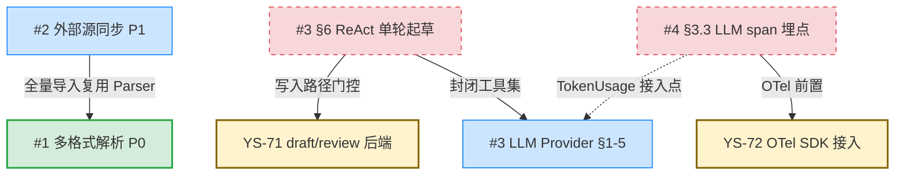

# P1 架构演进路线索引

> 本文串联 Mora 借鉴 WeKnora 规划在 P1 阶段产出的四份架构决策书（`design-docs/10`–`13`），给出依赖关系、门控子 issue 与分阶段推进顺序，供研发排期与评审定位。产品侧规划见 YS-70 issue；本文是「架构演进路线图」统筹产出。

## 0. 定位

P1 架构层选型已全量收敛：四份决策书各落独立分支 + PR，选型、接口、被低估改动、License 合规均已核实。本索引的作用是把分散的决策书串成一条可执行的演进链——谁先做、谁等谁、哪个门控未解。

**核心判断**：四项并非串行依赖，多数可并行；真正的串行门控只有两条——`draft/review 后端`（YS-71）门控 ReAct 单轮起草；`OTel SDK 接入`（YS-72）门控 LLM span 埋点。

## 1. 决策书清单

| # | 决策书 | 文件 | 分支 | PR | 阶段 | 门控状态 |
|---|---|---|---|---|---|---|
| #1 | 多格式解析 | `10-multi-format-parsing-decision.md` | `docs/multi-format-parsing-decision` | [#5](https://github.com/lynn901/mora/pull/5) | **P0** | ✅ table §8 已定，可立即实现 |
| #2 | 外部源同步 | `11-external-source-sync-decision.md` | `docs/external-source-sync-decision` | [#6](https://github.com/lynn901/mora/pull/6) | P1 | credentials 复用定稿时研发确认，无外部门控 |
| #3 | LLM Provider + ReAct | `12-llm-provider-react-decision.md` | `docs/llm-provider-react-decision` | [#7](https://github.com/lynn901/mora/pull/7) | P1 | §1–5 Provider 定稿可立即实现；§6 ReAct 待 YS-71 |
| #4 | LLM 追踪 | `13-llm-tracing-decision.md` | `docs/llm-tracing-decision` | [#8](https://github.com/lynn901/mora/pull/8) | P1 | §3.3 埋点待 YS-72 |

## 2. 依赖关系图

**读图要点**：
- **P0 独立**：#1 多格式解析是 P0，不依赖任何 P1 项；其余三项（#2/#3/#4）都依赖 #1 已完成的 Parser（#2 全量导入复用，#3 ReAct 检索复用 RAG，#4 追踪覆盖 RAG 链路）。
- **三路并行**：#2 外部源同步、#3 LLM Provider、YS-72 OTel SDK 接入三者**互不依赖**，可同时启动。
- **两条串行门控**：#3 §6 ReAct 等 YS-71；#4 §3.3 LLM span 等 YS-72。门控解除前，对应章节挂起，但各自决策书的其余章节不阻塞。

## 3. 门控子 issue

| 子 issue | 标题 | 门控对象 | 域归属 | 验收口径 |
|---|---|---|---|---|
| [YS-71](mention://issue/5cdf4d83-5255-4a65-bd0d-3f2ff2d5ad44) | draft/review 文档审阅后端 | #3 §6 ReAct 单轮起草 | mora 文档域 | 见 YS-71 内 PM 细化口径（状态机/存储/路由/MCP 落地/RBAC 审计） |
| [YS-72](mention://issue/930f44e9-345e-4e09-8003-8973f99bdbf0) | OTel SDK 接入 Go 服务 | #4 §3.3 LLM span 埋点 | mora 基础设施可观测层 | 见 YS-72 内 PM 细化口径（Tracer Provider/传播/日志注入/部署/配置） |

两门控子 issue 均已立（priority high），独立于决策书推进；验收口径由 PM 按 prd-writer 标准细化并已落 YS-71/YS-72。门控解除后，对应决策书章节（#3 §6、#4 §3.3）即可补入实现。

## 4. 分阶段推进顺序

### 阶段 P0（近期，独立）

- **#1 多格式解析**：选型 §1–7 + table §8 全定稿，可立即实现。Parser 模块 + converter·extract table 扩展 + import·export 路由。table 估期 ~6d（与 §1–7 选型实现并行）。这是其余三项的前置基础。

### 阶段 P1a（三路并行启动）

- **#2 外部源同步**：飞书/语雀连接器，全量导入复用 #1 Parser，增量对账靠 `sync_connectors`/`document_sources`/`sync_runs` 三表。估期 ~12d。`credentials` 密钥加密复用点待研发定稿时确认（见 §5）。
- **#3 §1–5 LLM Provider**：`LLMProvider` 接口（镜像 `EmbeddingProvider`）+ `OllamaLLMProvider` + `OpenAICompatProvider` + `LLM_*` 配置。估期 ~5d。**不依赖任何门控**，可立即启动。
- **YS-72 OTel SDK 接入**：把 `07 §7` 既定设计落地，Tracer Provider + 传播 + 日志注入 + 部署 + 配置。是 #4 的前置，但与 #2/#3 并行。

### 阶段 P1b（门控解除后补入）

- **#3 §6 ReAct 单轮起草**：等 YS-71 闭环。自研轻量循环 + 封闭工具集（仅 Mora 内部 MCP 工具）。估期 ~3–4d。
- **#4 §3.3 LLM span 埋点**：等 YS-72 闭环。`genaiconv` 包开箱即用，在 `OllamaLLMProvider.Chat` 埋 `gen_ai.*` span。估期 ~0.5d。

### 阶段 P2（远期，见 YS-70 产品规划）

多步 ReAct（封闭工具集，工具链编排 + 并行调用 + 人工审批）、知识图谱导航、Langfuse 可选增强、IM 极简桥接——见 YS-70 §阶段三。

## 5. 待确认项（不阻塞主路径）

| 项 | 归属 | 说明 |
|---|---|---|
| #2 `credentials` 密钥加密复用点 | 研发定稿确认 | 架构师标注为定稿时研发确认项；PM 已在 YS-71/YS-72 排期时安排研发核实现有密钥封装基建，结果回填 #2 |
| draft 态是否进 FTS/向量 | 研发确认 | YS-71 AC-10：draft/in_review/rejected 是否进 RAG 索引，还是仅 approved→published 才进；PM 倾向 RBAC 硬约束兜底、不依赖状态做索引门控，待研发确认 |
| 审阅人是否需新增 `reviewer` 角色 | 架构师/研发 | YS-71：P1 先复用 `write` 角色，`reviewer` 细粒度角色列 P1.5 |
| OTel 采样与 event 结构兼容 | 研发 | YS-72：采样策略（10% + 错误 100%）、Valkey Stream event 加 `traceparent` 的向后兼容 |

## 6. 与产品规划（YS-70）的映射

本索引是 YS-70 产品侧规划「P1 架构演进」的架构落地视图：

| YS-70 维度 | 对应决策书 | YS-70 优先级 | 架构落地状态 |
|---|---|---|---|
| 多文档格式解析 | #1 | P0 | ✅ 全量定稿 |
| 外部数据源同步 | #2 | P1 | ✅ 全量定稿 |
| ReAct Agent | #3 | P1→P2 | ✅ Provider 定稿；ReAct 待 YS-71 |
| 可观测性追踪 | #4 | P1 | ✅ 选型定稿；埋点待 YS-72 |
| Wiki 自动生成 | — | 观察 | 不立项（见 YS-70 §1.4） |
| 多 IM 渠道 | — | P3 | 不立项（见 YS-70 §1.5） |

产品侧六维度规划中，四项进入 P0/P1 架构落地，两项列入观察/P3 不立项。架构层到此交付完毕，本 issue（YS-70）进入 in_review 由人评审；P0 实现与 P1 子 issue 实现另起研发 issue 排期。
