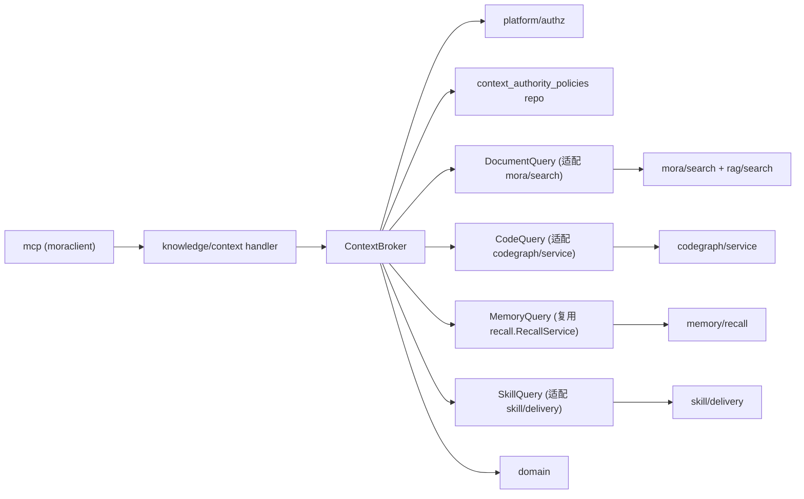

# 19. Phase 6：Context Broker 与自动路由（Intent Router / Budgeter / 权威策略 / 评测）

> 对应设计文档 `design-docs/11-human-agent-knowledge-blueprint.md` §7（检索与上下文交付）、§13.2（检索质量指标）、Phase 5 门禁；`design-docs/12-human-agent-knowledge-architecture.md` §9（检索与 Context Broker）、§11.1–11.4（API/MCP 演进）、§14（可观测与 SLO）、§15（故障降级）、§16.7（Phase 6 计划与门禁）、§3.1 目录预留 `knowledge/context`；`design-docs/15-context-proxy-design.md` §5、§12.3（Proxy 调用 Broker 内部 API）。承接 YS-100。
>
> 本文是**架构层交付物**：定义 Intent Router、标准化 `KnowledgeCandidate` 收敛、四个内置 Authority Policy、Budgeter、Citation Builder、跨类型并行查询/去重/冲突/降级、离线评测集与线上质量指标的架构边界与不变量。**不含** Go handler / DB migration / 业务逻辑实现——这些由研发（`[@mora后端研发]`）落地。实现路径与现有 Phase 0–5 代码 seam 一一对齐，研发可照此编码。

---

## 0. 决策摘要

| # | 决策 | 结论 | 依据 / 权衡 |
|---|---|---|---|
| D1 | 模块归属 | 新增 `internal/module/knowledge/context/`（12 §3.1 已预留目录），作为知识底座的**交付收敛层**。不新增一级资产类型、不新增状态数据库；编排已有类型查询端口，不复制业务逻辑 | 12 §3.1 目录预留 `context/ # 类型路由、排序、预算、引用`；§3.2「`knowledge/context` 可以编排类型查询端口，但不能绕过 `platform/authz`」；§0 决策 1「控制面留在 Mora API」 |
| D2 | Candidate 标准化收敛 | 统一 `KnowledgeCandidate`（12 §9.3）为跨类型交付的唯一形状。现有 `recall.KnowledgeCandidate`（memory 维度，含 `UnitID/MemoryType`）通过 **adapter** 收敛到统一 shape，**不破坏**已稳定的 Phase 4 召回契约与 REST 序列化；新增 `document/code/skill` 维度 candidate。统一 shape 新增 `ConflictTags []string`（架构评审采纳，§7.2）承载候选自身语义标签（`old_spec`/`impl_drift` 等），与 `Relations`（Phase 1 `relation_type` 有向边）分工 | 12 §9.3 标准 Candidate；`internal/module/memory/recall/types.go` 已有 memory 维度 candidate；避免 Phase 4 REST 返回形状回归（YS-98 已 done）；`relation_type` DB CHECK（迁移 014）不接受扩展语义标签，须以 candidate 字段承载 |
| D3 | 类型查询端口对齐 | 四端口 `DocumentQuery.Search` / `CodeQuery.Search` / `MemoryQuery.Recall` / `SkillQuery.Discover`（12 §9.4）首版复用**现有实现 seam**：Memory=已实现（`recall.RecallService`）；Document=适配 `mora/search` HybridSearcher；Code=适配 `codegraph/service` 只读查询；Skill=适配 `skill/delivery` ArchiveReader。端口返回统一 candidate，但保留专用工具不强制压成通用 Search | 12 §9.4「类型端口返回标准 Candidate，但保留专用工具」；现有 `recall.RecallService` 已是 `MemoryQuery` 实现 |
| D4 | Intent Router 规则化 | 首版 Intent Router 用**规则路由**（关键词/AssetTypes 显式/默认 fallback），不引入意图分类器模型。意图枚举四值：`spec`（规范要求）/ `revision`（revision 实现）/ `rationale`（决策原因）/ `procedure`（执行流程），对齐 §9.5 四策略 | 12 §9.5 四策略表；§7.2「权威顺序随查询意图变化」；避免首版引入模型推理的延迟与不确定性，意图分类留作后续演进（§9 开放决策） |
| D5 | Authority Policy 版本化配置 | 四个内置策略存于新增 `context_authority_policies` 表（workspace + intent 维度，版本化 `policy_version`），查询审计记录所用 policy version。**不维护单一全局「文档永远高于代码」排序** | 12 §9.5「策略保存在版本化配置中，查询审计记录所用 policy version」「系统不维护单一全局排序」；§7.2 权威顺序随意图变化 |
| D6 | Budgeter 先目录后正文 | 默认返回资产目录、摘要和引用；正文由 Agent 再调类型工具读取。每资产类型设最大条目和 token 占比，**单资产不能占满预算**。Budgeter 输出**截断原因**与继续读取工具，不静默截断引用 | 12 §9.6「默认先返回资产目录、摘要和引用」「每种资产设置最大条目和 token 占比，单个资产不能占满预算」；§11.4「上下文预算不足 → 返回截断原因和继续读取工具，不静默截断引用」 |
| D7 | 跨类型并行 + 去重 + 冲突保留 | 各类型引擎**并发**返回 candidate，遵守共同 deadline；按 `asset_id` / `asset_version_id` / `content_hash` 去重；**冲突关系保留不合并**（同源 contradicts/旧规范/实现偏差并列展示）。Provider 故障、授权过滤后为空、真实无结果三状态**可区分**，不混为「没有知识」 | 12 §9.2 步骤 4/6、§9.6、§11.4；验收门禁「三者状态可区分」 |
| D8 | 降级与 partial response | 部分类型超时/故障返回 partial response + 结构化 `degraded_sources`；CodeGraph 超时不阻塞文档；Qdrant 不可用降级 FTS；Reranker 不可用保留融合排序。**不得把失败解释为「没有知识」** | 12 §9.6、§15 故障降级表、§11.4「部分类型超时 → partial success + degraded_sources」 |
| D9 | Citation Builder | 统一补齐 `asset_id / asset_type / source_ref / version_or_revision / updated_at / authority / confidence / 精确 locator`（11 §7.4）。复用各类型已携带的 `Citation` 子结构（memory 已有 evidence locator），Broker 层做**最终授权后**的字段补齐与格式统一，不重新解析 | 11 §7.4 可引用结果；12 §9.2 步骤 9「Citation Builder 补齐版本和精确 locator」；§9.3 `Citation` 字段 |
| D10 | 授权两段关 | **检索前**：Authorization Service 计算 `AuthzContext`（decision_id + AllowedAssetIDs/revision），作为硬过滤下推到各类型端口。**检索后**：对返回 candidate ID **批量**做最终授权检查（batch post-check），通过子集才进排序/预算。缓存 key 必须含 authz revision + asset version + policy version | 12 §9.2 步骤 2/5、§5.3 决策流水线（Provider 收签名 capability → 返回 → Broker batch post-check）、§5.5 索引层权限、§5.6 撤权与缓存、§18 扩展 5「缓存 key 必须包含 authz revision、asset version 和 policy version」 |
| D11 | 评测集分两类 | **离线评测集**（Recall@K / nDCG / 引用正确率 / 延迟，按文档/代码/记忆/Skill 分开）+ **线上质量指标**（Prometheus 指标 + 抽样审计）。离线集是发布前锁定阈值的载体；线上指标是运行时 SLO 观测。研发交付评测 runner skeleton，测试工程师落地 case 集 | 11 §13.2 检索质量指标；12 §14.1 指标、§14.3 SLO；YS-100 交付项 3；角色分工：架构师主导 Broker、测试工程师协同评测集 |
| D12 | 不取代 MCP / 不替代类型专用工具 | Broker 是 MCP 与 REST 的**后端编排层**，不直连类型引擎也不复制授权；MCP 工具仍走 `moraclient` 内部 API 调 Broker。类型专用工具（code_callers/impact、memory_evidence_read、skill_resources）不强制压成通用 Search，Broker 只做收敛检索 | 12 §0 决策 8「MCP 仍是 Agent 第一入口」、§3.2「mcp 只依赖内部 API Client」；§9.4 专用工具保留 |

---

## 1. 范围与依赖

### 1.1 本文档覆盖

落地设计文档 12 §16.7 的三项交付（与 YS-100 issue 描述一致）：

1. **Intent Router、Candidate 标准化、Authority Policy、Budgeter**（§0 D1–D6、§3、§4、§5、§6）。
2. **跨类型并行查询、去重、冲突、partial response + `degraded_sources`**（§0 D7/D8、§7）。
3. **离线评测集与线上质量指标**（§0 D11、§9）。

### 1.2 依赖（Phase 0–5，已落地）

本文档假设以下基线已存在（已核对 migrations 013–023；代码 `internal/domain/`、`internal/platform/authz/`、`internal/module/{memory,skill,knowledge/codegraph,rag,mora/search}`）：

- **013 knowledge_core / Phase 0**：`knowledge_assets` / `knowledge_asset_versions`（`asset_type` 含 `document`/`codebase`/`memory`/`skill`）、`workspace_authz_revisions`、`authorization_decisions`、`agent_bindings`、`platform/authz.Service`（`Authorize` / `IssueDecision` / `VisibleAssets`）、`AuthzContext`（含 `AllowedAssetIDs` / `DecisionID` / `AuthzRevision`）。
- **014 phase1_asset_source**：`knowledge_sources` / `knowledge_relations`（`relation_type` 含 `supersedes`/`contradicts`）/ `asset_projections`（`projection_kind` 含 `fts`/`vector`/`summary`/`relation`）。
- **Phase 2 wiki**：Wiki 页面是 Document Asset，走 `document_search`/`document_read`；Broker 不特殊处理。
- **Phase 3 codegraph**：`codegraph/service` 只读查询（explore/search/files/node/callers/callees/impact/status），Provider 端口 `provider.CodeGraphProvider`，fail-closed 源码树校验。
- **Phase 4 memory**：`recall.RecallService` 已实现 `MemoryQuery.Recall`，返回 memory 维度 `KnowledgeCandidate`（`internal/module/memory/recall/types.go`）；`memory_feedback` 反馈落库。
- **Phase 5 skill**：`skill/delivery.go` ArchiveReader（`ArchiveOpener`）、Binding delivery_mode（tool/summary/inline）、`skill_list/skill_read/skill_resources/skill_propose` MCP 工具。
- **既有检索**：`internal/module/rag/search.HybridSearcher`（BM25+向量 RRF 融合，RBAC 硬过滤）、`internal/module/mora/search`（文档 FTS）。

### 1.3 非目标

- **不引入意图分类器模型**（D4，首版规则路由；模型分类留 §10 开放决策）。
- **不实现 Context Proxy 自动捕获**（doc 15 的透明 Proxy 注入是独立轨道；Broker 只提供 `POST /internal/v1/knowledge/context` 供 Proxy 主动调用，不反向拦截模型流量）。
- **不压平类型专用工具**：`code_callers/impact`、`memory_evidence_read`、`skill_resources` 等仍由各自 MCP 工具暴露；Broker 只做收敛检索（D12）。
- **不新增一级资产类型**（12 §0 决策 11）；Broker 编排的仍是 document/codebase/memory/skill 四类既有资产。
- **不做生产 backfill**；首版用测试 Asset 验证路由与预算（沿用 Phase 0 基线）。
- **不含** Go handler / DB migration / 业务逻辑实现——由 `[@mora后端研发]` 落地。

---

## 2. 数据架构

Phase 6 **不新增内容表**。Broker 是编排层，所有内容仍由各类型引擎的权威记录与投影承载。仅新增**策略配置表**与**评测记录表**（控制面，可重建，非权威内容）。

### 2.1 新增表：`context_authority_policies`

版本化的权威策略配置（D5）。每个 workspace + intent 有一份策略，`policy_version` 递增，审计记录所用版本。

```sql
-- 024_phase6_context_authority_policies.up.sql
CREATE TABLE IF NOT EXISTS context_authority_policies (
    id           UUID PRIMARY KEY DEFAULT gen_random_uuid(),
    workspace_id UUID NOT NULL REFERENCES workspaces(id) ON DELETE CASCADE,
    intent       TEXT NOT NULL,                          -- spec|revision|rationale|procedure (§9.5)
    policy_version INT NOT NULL,                          -- 递增，审计引用
    is_current   BOOLEAN NOT NULL DEFAULT TRUE,           -- 同 (workspace_id,intent) 仅一行 true
    -- 策略内容：各 asset_type 的 authority 权重、首要依据、必须展示的冲突
    config       JSONB NOT NULL,
    created_at   TIMESTAMPTZ NOT NULL DEFAULT now(),
    superseded_at TIMESTAMPTZ,                           -- 被新版本取代时置位
    created_by_id UUID,                                  -- 审核/配置者
    CONSTRAINT chk_authority_intent CHECK (intent IN ('spec','revision','rationale','procedure')),
    CONSTRAINT chk_authority_one_current EXCLUDE (workspace_id WITH =, intent WITH =) WHERE (is_current)
);

CREATE UNIQUE INDEX idx_authority_policies_current
    ON context_authority_policies (workspace_id, intent) WHERE is_current;
CREATE INDEX idx_authority_policies_version
    ON context_authority_policies (workspace_id, intent, policy_version DESC);
```

`config` JSONB 结构（首版四内置策略的默认值由 PM 治理，架构提供 schema）：

```jsonc
{
  "primary_basis": ["document"],            // 该意图下的首要依据 asset_type 列表
  "must_surface_conflicts": ["old_spec", "impl_drift"],  // 必须并列展示的冲突类型
  "weights": {                              // 各 asset_type 的 authority 权重（0..1）
    "document": 0.9, "codebase": 0.5, "memory": 0.4, "skill": 0.3
  },
  "exclude_when": ["deprecated", "version_mismatch"]    // 排除条件（§7.2 被废弃/版本不匹配默认不进结果）
}
```

### 2.2 新增表：`context_eval_runs`（离线评测记录）

评测 runner 的运行记录（D11）。case 集本身是 Go 测试代码（同 codegraph eval 先例），此表记录每次跑批的聚合指标，供发布前阈值锁定比对。

```sql
-- 024_phase6_context_eval_runs.up.sql（同迁移文件下半部分）
CREATE TABLE IF NOT EXISTS context_eval_runs (
    id           UUID PRIMARY KEY DEFAULT gen_random_uuid(),
    run_at       TIMESTAMPTZ NOT NULL DEFAULT now(),
    dataset_tag  TEXT NOT NULL,                          -- 评测集版本标签
    intent       TEXT,                                   -- nil = 全意图
    asset_type   TEXT,                                   -- nil = 全类型（Recall@K/nDCG 按类型分报）
    recall_at_k  DOUBLE PRECISION,
    ndcg         DOUBLE PRECISION,
    citation_accuracy DOUBLE PRECISION,                 -- 引用正确率
    p95_latency_ms INT,
    case_count   INT NOT NULL,
    pass         BOOLEAN NOT NULL,                      -- 是否达到锁定阈值
    report_json  JSONB NOT NULL,                        -- 完整逐 case 结果
    CONSTRAINT chk_eval_intent CHECK (intent IS NULL OR intent IN ('spec','revision','rationale','procedure'))
);

CREATE INDEX idx_eval_runs_dataset ON context_eval_runs (dataset_tag, run_at DESC);
```

### 2.3 与现有表的关系

```text
context_authority_policies ──(workspace_id)──> workspaces
context_authority_policies ──(audit 引用 policy_version)──> authorization_decisions (间接，审计 attribute)
context_eval_runs            独立，无外键（评测产物）

Broker 编排时只读：
  knowledge_assets / knowledge_asset_versions  (asset 身份与版本)
  knowledge_relations                           (冲突 contradicts/supersedes，§7 冲突保留)
  asset_projections                              (fts/vector/summary 投影状态)
  authorization_decisions / workspace_authz_revisions (授权 revision)
```

### 2.4 回滚迁移

```sql
-- 024_phase6_context_authority_policies.down.sql
DROP TABLE IF EXISTS context_eval_runs;
DROP TABLE IF EXISTS context_authority_policies;
```

---

## 3. 模块与代码组织

### 3.1 目标目录（12 §3.1 已预留 `knowledge/context`）

```text
internal/module/knowledge/context/
  broker.go          # ContextBroker 主编排：§9.2 十步流水线
  intent.go          # IntentRouter：规则路由（D4），意图枚举四值
  candidate.go       # 统一 KnowledgeCandidate（D2）+ 各类型 adapter
  policy.go          # AuthorityPolicy 端口 + 四内置策略实现（D5）
  budgeter.go        # Budgeter：目录→摘要→片段降级（D6）
  citation.go        # CitationBuilder：补齐版本与 locator（D9）
  dedup.go           # 跨类型去重 + 冲突保留（D7）
  degrade.go         # partial response + degraded_sources（D8）
  ports.go           # DocumentQuery/CodeQuery/MemoryQuery/SkillQuery 端口（12 §9.4）
  service.go         # 装配：端口注入 + authz.Service 注入 + 配置加载
  handler.go         # REST/internal handler（POST /knowledge/context, /knowledge/search）
  eval/
    runner.go        # 离线评测 runner skeleton（D11，同 codegraph/eval 先例）
    cases_test.go    # case 集（研发 skeleton，测试工程师补预期答案）
```

### 3.2 依赖规则（12 §3.2 扩展）



必须遵守（12 §3.2 扩展）：

- `knowledge/context` **可以编排类型查询端口，但不能绕过 `platform/authz`**（§3.2 原文）。
- Broker 不直接依赖 Qdrant/Postgres 查询；通过端口接口调用各类型引擎。
- `mcp` 只依赖 `moraclient` 内部 API，不导入 `knowledge/context` repository。
- Provider adapter 不接受用户提交的 `allowed_asset_ids`，只接受 Mora 服务端构造的 `AuthzContext`。
- 类型引擎（memory/skill/codebase）不直接发布资产；返回 candidate 供 Broker 收敛。

### 3.3 装配 seam（对接既有 wiring）

- **MemoryQuery**：直接复用 `recall.RecallService`（已实现 `Recall(ctx, AuthContext, KnowledgeQuery) ([]KnowledgeCandidate, error)`，`internal/module/memory/recall/service.go:45`）。memory 维度 candidate 经 adapter 收敛到统一 shape（D2）。
- **DocumentQuery**：新增 adapter 包裹 `mora/search.SearchExecutor` + `rag/search.HybridSearcher`，把 `SearchHit`/`search.Result` 映射为统一 candidate。
- **CodeQuery**：新增 adapter 包裹 `codegraph/service` 的只读查询（search/explore），把 `CodeHit` 映射为统一 candidate，携带 `commit`/`source_tree_ref` 作为 version。
- **SkillQuery**：新增 adapter 包裹 `skill/delivery.go` ArchiveReader，按 binding delivery_mode 返回 candidate（tool=SKILL.md head、summary=description、inline=resource list）。
- **authz.Service**：`Authorize` 产出 `AuthzContext`（检索前），`VisibleAssets`/批量 post-check 产出允许子集（检索后）。

---

## 4. Intent Router（D4）

### 4.1 意图枚举

```go
// Intent is the query intent that selects the authority policy (12 §9.5).
// Four built-in intents map 1:1 to the four built-in authority policies.
type Intent string

const (
    IntentSpec      Intent = "spec"      // 规范要求：当前有效且经治理批准的文档
    IntentRevision  Intent = "revision"  // revision 实现：固定 commit 的代码/配置/迁移/测试
    IntentRationale Intent = "rationale" // 决策原因：决策文档、审核 Memory 与证据
    IntentProcedure Intent = "procedure" // 执行流程：已批准 Skill、Runbook、环境约束
)
```

### 4.2 路由规则（首版规则化，不引入模型）

```text
IntentRouter.Route(query, assetTypes, filters) (Intent, []AssetType):

1. 显式 AssetTypes 非空 → 用调用方声明的类型集合；Intent 按 query 关键词推断
2. query 含「规范/要求/规格/should/must」       → IntentSpec,      [document]
3. query 含「实现/代码/函数/调用/commit/revision」→ IntentRevision,  [codebase, document]
4. query 含「为什么/决策/原因/why/rationale」     → IntentRationale, [document, memory]
5. query 含「如何执行/流程/步骤/Runbook/how」     → IntentProcedure, [skill, document]
6. fallback → IntentSpec, [document, memory]   // 默认规范+记忆，最保守
```

- 路由只决定**策略**与**类型集合**，不决定授权（授权由 authz.Service 独立计算）。
- 关键词表是版本化配置的一部分（§5），PM 可调，不在代码硬编码。
- 模型化意图分类是 §10 开放决策，首版不实现。

### 4.3 IntentRouter 端口

```go
// IntentRouter selects the query intent and target asset-type set (12 §9.2 step 3).
// First version uses rule-based routing; model-based classification is deferred (§10).
type IntentRouter interface {
    Route(ctx context.Context, q KnowledgeQuery) (Intent, []domain.AssetType, error)
}
```

---

## 5. Authority Policy（D5）

### 5.1 四内置策略（12 §9.5 表）

| Intent | 首要依据 (primary_basis) | 必须展示的冲突 (must_surface_conflicts) | 默认权重（document/code/memory/skill） |
|---|---|---|---|
| `spec` | 当前有效且经治理批准的 document | 旧规范、实现偏差 | 0.9 / 0.5 / 0.4 / 0.3 |
| `revision` | 固定 commit 的 codebase、配置、迁移、测试 | 与文档不一致 | 0.5 / 0.9 / 0.3 / 0.4 |
| `rationale` | 决策 document、审核 memory 与证据 | 低置信或被替代 memory | 0.8 / 0.3 / 0.9 / 0.3 |
| `procedure` | 已批准 skill、Runbook、环境约束 | 版本不匹配或缺少权限 | 0.6 / 0.4 / 0.4 / 0.9 |

- 默认值由架构提供（本表），PM 治理实际配置（角色分工）。
- **系统不维护单一全局「文档永远高于代码」排序**（12 §9.5）。
- 当高权威资产互相冲突时，返回冲突及各自引用，**不静默选择一个答案**（11 §7.2）。
- 代码资产只能说明所锚定 revision 的静态实现；不得据未验证的部署/运行时证据宣称生产当前行为（11 §7.2）。
- **`must_surface_conflicts` 的两类来源**（架构评审，详见 §7.2）：`contradicts`/`supersedes` 走 `Relations`（Phase 1 `relation_type`，有向边、带 `TargetID`）；`old_spec`/`impl_drift`/`doc_inconsistency`/`low_confidence`/`superseded_memory`/`version_mismatch`/`missing_permission` 走 candidate 新增 `ConflictTags []string`（候选自身属性、无对端）。PM 配置的冲突标签集须据此拆分到两个字段。

### 5.2 AuthorityPolicy 端口

```go
// AuthorityPolicy scores and orders candidates for a given intent (12 §9.5).
// The policy is versioned (context_authority_policies.policy_version);
// the broker records the applied policy_version in the audit summary (§9.2 step 10).
type AuthorityPolicy interface {
    Intent() Intent
    // Score blends authority/freshness/confidence/task-match per §9.5 + the policy weights.
    Score(candidates []KnowledgeCandidate, q KnowledgeQuery) []ScoredCandidate
    // ConflictsToSurface returns the conflict tags this policy must not drop
    // (e.g. contradicts/old_spec/impl_drift) — matched against the union of
    // candidate.Relations[i].RelationType ∪ candidate.ConflictTags (§7.2).
    // They are kept even if low-scoring.
    ConflictsToSurface() []string
}
```

### 5.3 策略加载

- 启动时加载 `context_authority_policies (is_current=true)` 到内存；`policy_version` 纳入缓存 key（§8）。
- 策略变更（PM 配置新版本）→ 新 `policy_version` → 缓存失效 → 新请求读到新策略。
- 四内置策略有 Go 默认实现（`policy.go`），DB 配置覆盖权重与冲突类型列表，不覆盖策略逻辑。

---

## 6. Budgeter（D6）

### 6.1 预算模型

```go
type Budget struct {
    MaxTokens int            // 总 token 预算（来自 KnowledgeQuery.MaxTokens 或 workspace 默认）
    MaxItems  int            // 总条目上限
    TypeQuota map[domain.AssetType]Quota // 每类型配额（条目数 + token 占比）
    Timeout   time.Duration  // 共同 deadline（默认 2s，12 §14.3 SLO）
}

type Quota struct {
    MaxItems   int     // 该类型最大条目
    TokenShare float64 // 该类型 token 占比上限（0..1）
    // PerAssetTokenShare caps a single asset's token footprint within this
    // type's quota (架构评审采纳，§6.2 单资产降级；0 = 不启用单资产层约束，
    // 回退到仅类型层 TokenShare）。单资产 token ≥ MaxTokens·PerAssetTokenShare
    // 时降级为「目录+引用」并记 TruncationReport.reason=single_asset_capped。
    // PM 默认 0.30（占预算 30%）；与 TokenShare 取交集：单资产既不超过类型
    // quota 也不超过单资产 ratio。
    PerAssetTokenShare float64
}
```

### 6.2 降级阶梯（目录 → 摘要 → 片段 → 工具提示）

```text
Budgeter.Select(scored []ScoredCandidate, budget Budget) (selected []KnowledgeCandidate, truncation TruncationReport):

1. 按 policy 排序后的 candidate 列表
2. 优先入选「资产目录 + 摘要 + 引用」（默认不返回正文，12 §9.6）
3. 单资产 cap：若 candidate token 估算 ≥ MaxTokens·Quota.PerAssetTokenShare（>0），
   该资产降级为「目录+引用」（不返回摘要正文），记 TruncationReport.reason=single_asset_capped
4. 逐条累计 token，达到该类型 quota 或总预算时停止
5. 剩余候选：返回「继续读取工具提示」（指向 asset_read/code_node/memory_evidence_read/skill_resources）
6. 输出 TruncationReport：截断原因（single_asset_capped / quota_exhausted / budget_full / deadline）、被截断候选的 asset_id 列表、继续读取工具名
```

- **不静默截断引用**（12 §11.4）：截断必须返回原因 + 继续读取工具。
- **单资产不能占满预算**（12 §9.6）：两层约束——类型层 `Quota.TokenShare` 避免一个长文档挤掉其他**类型**；单资产层 `Quota.PerAssetTokenShare`（架构评审采纳）避免一个长文档挤掉**同类型其他条目**，超额即降级为「目录+引用」。PM 默认 `PerAssetTokenShare=0.30`，研发可置 0 回退到仅类型层。
- 默认先目录后正文，正文由 Agent 再调用类型工具读取（11 §7.3、12 §9.6）。

### 6.3 预算来源

- `KnowledgeQuery.MaxTokens` / `MaxItems`（调用方显式）。
- 未提供时用 workspace 默认（`governance_profiles` 或新增配置项，PM 治理）。
- Context Proxy 调用时（doc 15 §5.4）：`mora_budget = min(total - agent_budget, total * max_inject_ratio)`，Broker 接收的是已计算好的 `MaxTokens`。

---

## 7. 跨类型并行查询、去重、冲突与降级（D7/D8）

### 7.1 并行查询与共同 deadline

```text
Broker.Execute(ctx, q):
  step 1-2: 解析 principal + authz.Authorize → AuthzContext(decision_id, AllowedAssetIDs, revision)
  step 3:   IntentRouter.Route → (Intent, assetTypes)
  step 4:   并发调用各类型端口（errgroup + 共同 deadline = min(q.Timeout, 2s)）
            每端口返回 []KnowledgeCandidate 或 (error, degraded_reason)
  step 5:   合并所有 candidate ID → authz 批量 post-check（VisibleAssets）→ 允许子集
  step 6:   DedupAndKeepConflicts（§7.2）
  step 7:   AuthorityPolicy.Score（按 Intent 加载策略）
  step 8:   Budgeter.Select（§6.2）
  step 9:   CitationBuilder.Build（§8）
  step 10:  审计摘要（入选/淘汰原因 + policy_version + authz_revision）
```

- CodeGraph 超时**不阻塞**文档结果（12 §9.6）。
- 每端口独立失败不阻断其他端口；失败端口进 `degraded_sources`。

### 7.2 去重与冲突保留（D7）

```go
// DedupAndKeepConflicts deduplicates candidates by asset_id / asset_version_id /
// content_hash, BUT keeps conflict relations (contradicts/old_spec/impl_drift)
// side by side instead of picking one (12 §9.2 step 6, §9.5 must_surface_conflicts).
func DedupAndKeepConflicts(candidates []KnowledgeCandidate, policy AuthorityPolicy) []KnowledgeCandidate
```

- **去重键**：`asset_id`（同资产不同版本取最新 ready）→ `content_hash`（同内容不同资产保留一条但记录同源）。
- **冲突来源（架构评审采纳增量）**：候选冲突信号由两个并集承载——
  - `Relations`（`RelationSummary`，复用 Phase 1 `relation_type` 枚举 `contradicts`/`supersedes`，DB CHECK 约束，迁移 014）——这是指向**另一资产**的有向边，带 `TargetID`；
  - `ConflictTags []string`（candidate 自身语义标签，`KnowledgeCandidate` 新增字段）——这是**候选自身属性**（无对端资产），承载 `old_spec`/`impl_drift`/`doc_inconsistency`/`low_confidence`/`superseded_memory`/`version_mismatch`/`missing_permission` 等扩展标签，由各类型 adapter 在收敛时标记（memory 侧复用 `Confidence`/`State`，code 侧复用 commit/revision 校验结果，skill 侧复用 version 校验）。
  - `DedupAndKeepConflicts` 按 `policy.ConflictsToSurface()`（=`config.must_surface_conflicts`）匹配 `Relations[i].RelationType ∪ ConflictTags`，命中即并列保留。
  - 不把扩展标签塞进 `relation_type`（DB CHECK 不允许新值，且它们不是资产间边）；不新建 `knowledge_relations` 行承载自身属性。
- **冲突保留**：若 `Relations` 含 `contradicts`/`supersedes` 且 policy 声明该冲突类型必须展示，**两方并列**，不合并、不择一。
- **排除条件**（§7.2）：被废弃（deprecated）、过期、版本不匹配的资产**默认不进结果**；权限是检索前硬过滤，不参与乘法评分。
- **`exclude_when` vs `must_surface_conflicts` 语义互斥**（架构评审裁定，防 PM 配置死锁）：排除发生在去重/评分**之前**，被排除的候选不进 `DedupAndKeepConflicts`，故**同一标签不得同时出现在一个策略的 `exclude_when` 与 `must_surface_conflicts`**——否则该冲突永远无法被展示（候选早已被排除）。四内置策略中 `version_mismatch` 出现在 `procedure`/`spec` 的 `must_surface_conflicts`，故其 `exclude_when` **不得含 `version_mismatch`**（PM §2.3 默认 `exclude_when=["deprecated","version_mismatch"]` 需对这两意图裁为 `["deprecated"]`）。PUT 校验须拒绝该互斥冲突。

### 7.3 降级与 partial response（D8）

```go
type DegradedSource struct {
    AssetType domain.AssetType
    Reason    string  // provider_timeout | provider_error | qdrant_unavailable | fts_fallback | rerank_unavailable
    Detail    string  // 脱敏摘要，不含正文/凭据
}

type ContextResponse struct {
    Candidates       []KnowledgeCandidate
    DegradedSources []DegradedSource
    Truncation      TruncationReport
    Intent          Intent
    PolicyVersion   int
    AuthzRevision   int64
    DecisionID      *uuid.UUID
    // 三状态可区分（验收门禁）：
    // HasResults() bool          — 真实有结果
    // IsEmptyAuthorized() bool   — 授权过滤后为空（有 candidate 但全被 post-check 拒）
    // IsEmptyNoResults() bool    — 真实无结果（所有端口返回空，无 degraded）
    // IsProviderDown() bool      — Provider 故障（degraded_sources 非空且无 candidate）
}
```

- **三状态可区分**（验收门禁）：Provider 故障 / 授权过滤后为空 / 真实无结果，不混为「没有知识」（12 §11.4）。
- Qdrant 不可用 → Document/Memory 降级 FTS（12 §9.6、§15）。
- Reranker 不可用 → 保留融合排序（RRF），不阻断。
- 所有类型引擎失败 → 返回结构化 `degraded_sources`，**不得把失败解释为「没有知识」**（12 §9.6）。

---

## 8. Citation Builder（D9）

### 8.1 统一引用结构（11 §7.4）

```go
type Citation struct {
    AssetID        uuid.UUID
    AssetType      domain.AssetType
    SourceRef      string   // source name/url（脱敏，不下发凭据）
    VersionOrRevision string // document: version_id; codebase: commit; memory: evidence_id; skill: package_version
    UpdatedAt      time.Time
    Authority      float64
    Confidence     *float64
    Locator        map[string]any // 精确位置：document block / 文件行号 / 会话消息 / Skill 资源
}
```

### 8.2 Builder 职责

- 在**最终授权后**（step 5 之后）补齐 `source_ref` / `version_or_revision` / `updated_at` / `locator`。
- 复用各类型 candidate 已携带的子结构（memory 的 evidence locator、code 的 file:line、document 的 block_id）。
- **不重新解析**，只做字段映射与格式统一。
- `ProjectionRef` 仅供内部诊断，**不返回**给 Agent（12 §9.3，memory recall 已有此约束，Broker 继承）。

---

## 9. 评测与质量指标（D11）

### 9.1 离线评测集

```text
指标（按 document/code/memory/skill 分开报，不聚合成单一数字，同 codegraph eval 先例）：
  Recall@K     — 召回率，K 由 dataset 锁定
  nDCG         — 排序质量
  CitationAccuracy — 引用正确率（≥ 95% 门禁）
  P95 Latency  — 端到端延迟（Context Broker P95 ≤ 2s，12 §14.3）
```

- 评测 runner skeleton 在 `internal/module/knowledge/context/eval/runner.go`（同 `codegraph/eval/runner.go` 先例）。
- case 集是 Go 测试代码（slice literal），CI 跑 `go test ./internal/module/knowledge/context/eval/`。
- 研发交付 skeleton + 默认 case；测试工程师（`[@Mora知识库测试工程师]`）补预期答案与多意图覆盖。
- 发布前锁定当期数据集阈值（YS-100 验收门禁「召回与延迟达到发布前锁定的当期数据集阈值」）。

### 9.2 线上质量指标（12 §14.1 扩展）

| 指标 | 说明 |
|---|---|
| `knowledge_context_duration_seconds{route}` | Broker 各阶段耗时（intent/authz/parallel/dedup/budget/citation） |
| `knowledge_context_tokens{type}` | 上下文预算消耗（按类型） |
| `knowledge_context_candidates_total{intent,type,disposition}` | candidate 入选/淘汰计数（disposition=selected/truncated/denied） |
| `knowledge_context_degraded_total{reason}` | 降级原因计数 |
| `knowledge_context_empty_total{state}` | 三状态计数（provider_down/empty_authorized/empty_no_results） |
| `knowledge_context_policy_version` | 当前策略版本（gauge） |
| `knowledge_authz_denied_total{action,type}` | 授权拒绝（复用 §14.1） |

### 9.3 审计（12 §13.4 扩展）

Broker 每次查询记录审计摘要：

```text
context.query{intent, policy_version, authz_revision, decision_id,
              asset_types, candidate_count, selected_count, truncated_count,
              degraded_sources, duration_ms}
```

审计参数只记录 ID、动作、策略版本、结果、耗时和脱敏摘要，**不记录完整正文**（12 §13.4）。

---

## 10. 开放决策（后续专项设计）

1. **意图分类器模型化**：首版规则路由（D4）；何时引入轻量分类器（local TEI/Ollama）与置信度门禁。
2. **短期结果缓存**：相同上下文重复请求的缓存策略，key 含 authz revision + asset version + policy version（12 §18 扩展 5、§19.11）；TTL 与失效。
3. **各资产类型初始配额**：document/code/memory/skill 的 MaxItems 与 TokenShare 默认值（12 §19.11）。
4. **Reranker 引入**：首版 RRF 融合；何时引入外部 Reranker 与 capability 约束（12 §5.5「不得把未通过 use 检查的正文发送到外部 Reranker」）。
5. **动态 Binding over-fetch**：Qdrant 无法一次精确过滤时的分页 over-fetch 阈值（12 §5.5）。

这些不改变本文的编排边界、授权两段关、去重冲突保留与降级原则。

---

## 11. API 契约（REST + 内部 + MCP）

### 11.1 REST 控制面（12 §11.1 子集）

```text
POST /api/v1/workspaces/{ws}/knowledge/search     # 直接类型化检索（不组装上下文）
POST /api/v1/workspaces/{ws}/knowledge/context      # Context Broker：路由+预算+引用
GET  /api/v1/workspaces/{ws}/knowledge/policies     # 列出权威策略
PUT  /api/v1/workspaces/{ws}/knowledge/policies/{intent}  # 更新策略（PM 治理）
```

### 11.2 内部 API（12 §11.2，doc 15 §12.3 复用）

```text
POST /internal/v1/knowledge/search                  # MCP Server 调用
POST /internal/v1/knowledge/context                 # MCP Server + Context Proxy 调用（doc 15 §12.3）
```

内部请求使用服务身份 + Mora 签发的短期 delegated context；`INTERNAL_SERVICE_TOKEN` 不能单独代表最终用户权限（12 §11.2）。

### 11.3 请求/响应示例

```jsonc
// POST /internal/v1/knowledge/context
// Request:
{
  "query": "为什么选择 ltree 而不是 adjacency list？",
  "workspace_id": "...",
  "agent_id": "...",                          // 可选
  "asset_types": [],                          // 空=由 IntentRouter 决定
  "filters": {"directory_id": "..."},
  "max_tokens": 4000,
  "max_items": 20,
  "timeout_ms": 2000,
  "include_content": false                    // 默认 false：目录+摘要+引用
}

// Response:
{
  "intent": "rationale",
  "policy_version": 3,
  "authz_revision": 142,
  "decision_id": "...",
  "candidates": [
    {
      "asset_id": "...", "asset_type": "document",
      "title": "目录树存储选型决策", "snippet": "...",
      "score": 0.91, "authority": 0.9, "freshness": 0.8,
      "citation": {"version_or_revision": "v3", "locator": {"block_id": 12}},
      "relations": [{"relation_type": "contradicts", "target_id": "...", "target_title": "旧方案 adjacency list"}]
    }
  ],
  "degraded_sources": [
    {"asset_type": "codebase", "reason": "provider_timeout", "detail": "codegraph sidecar 2s 超时"}
  ],
  "truncation": {
    "reason": "budget_full",
    "truncated_asset_ids": ["..."],
    "continue_tools": ["document_read", "code_node"]
  }
}
```

### 11.4 MCP 演进（12 §11.3）

- 新增 MCP 工具 `knowledge_search` / `knowledge_context`（收敛检索，走 Broker）。
- **兼容期保留**现有 `search_knowledge_base` / `get_document` / `list_documents` 作为别名，`tools/list` 标记 deprecated，不改变权限语义（12 §11.3）。
- 类型专用工具（`code_callers`/`code_impact`/`memory_evidence_read`/`skill_resources`）**不压平**，仍由各自工具暴露（D12）。

### 11.5 错误语义（12 §11.4）

| 场景 | 行为 |
|---|---|
| 只读资源无权或不存在 | 空结果或统一 not_found，不泄露存在性 |
| 上下文预算不足 | 返回截断原因和继续读取工具，不静默截断引用 |
| Provider 未启用 | `capability_unavailable` |
| 部分类型超时 | partial success + `degraded_sources` |
| 版本构建中 | 返回最后可用版本和 `stale/building` 标记 |
| Provider 故障 / 授权过滤后为空 / 真实无结果 | 三状态可区分（§7.3） |

---

## 12. 验收门禁对齐

| YS-100 门禁 | 本文档落地 |
|---|---|
| 授权泄漏为 0 | §0 D10 两段关 + §7.1 step 5 批量 post-check + §8.1 授权后补引用；复用 Phase 0 authz 测试矩阵 |
| 上下文预算超限为 0 | §0 D6 Budgeter + §6.2 截断报告 + §6.2 单资产不能占满；`knowledge_context_tokens` 指标 |
| 引用正确率 ≥ 95% | §9.1 离线评测 CitationAccuracy + §8 CitationBuilder |
| 召回与延迟达到发布前锁定阈值 | §9.1 评测集 Recall@K/nDCG/P95，发布前锁定 |
| Provider 故障/授权过滤后为空/真实无结果三状态可区分 | §0 D7/D8 + §7.3 `ContextResponse` 三状态方法 + `knowledge_context_empty_total{state}` 指标 |

---

## 13. 与现有设计的关系

| 设计文档 | 本文处理 |
|---|---|
| 12 §9 检索与 Context Broker | 本文是其 Phase 6 落地，十步流水线一一对齐 |
| 11 §7 检索与上下文交付 | 权威顺序随意图变化（§5）、上下文预算（§6）、可引用结果（§8） |
| 15 Context Proxy | Proxy 主动调 `POST /internal/v1/knowledge/context`（§11.2），Broker 不反向拦截 |
| 05 RAG | DocumentQuery adapter 复用 HybridSearcher，RBAC 硬过滤不变 |
| 06 MCP | 新增 `knowledge_search`/`knowledge_context` 工具，走 moraclient 内部 API |
| 18 Phase 4 memory | memory 维度 candidate 经 adapter 收敛到统一 shape，不破坏 Phase 4 REST |
| 17 Phase 3 codegraph | CodeQuery adapter 复用只读查询，携带 commit 作为 version |

---

## 附录 A：Phase 6 不变量（扩写 12 附录 A）

16. Context Broker 编排不绕过 `platform/authz`：检索前 Authorize + 检索后批量 post-check。
17. 跨类型去重保留冲突：contradicts/旧规范/实现偏差并列展示，不静默择一。
18. 三状态可区分：Provider 故障 / 授权过滤后为空 / 真实无结果，不混为「没有知识」。
19. 上下文预算不足返回截断原因 + 继续读取工具，不静默截断引用。
20. 权威策略版本化：审计记录 policy_version；不维护单一全局排序。
21. 缓存 key 必须含 authz revision + asset version + policy version（12 §18 扩展 5）。
